# _ZENTASKS Migration Roadmap

**Visual representation of the migration strategy**

---

## Agent Migration Status

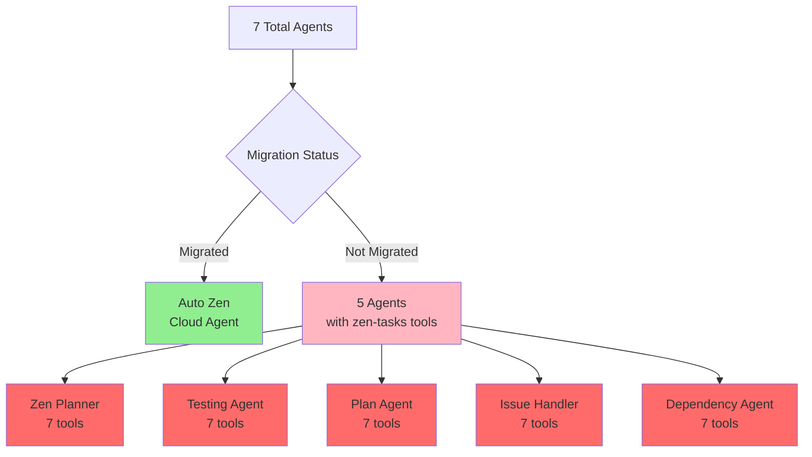

---

## Migration Dependency Chain

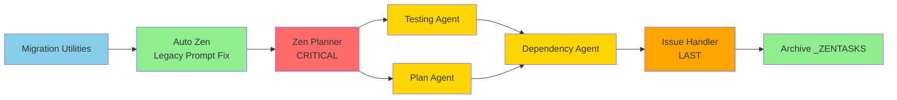

---

## Tool Migration Mapping

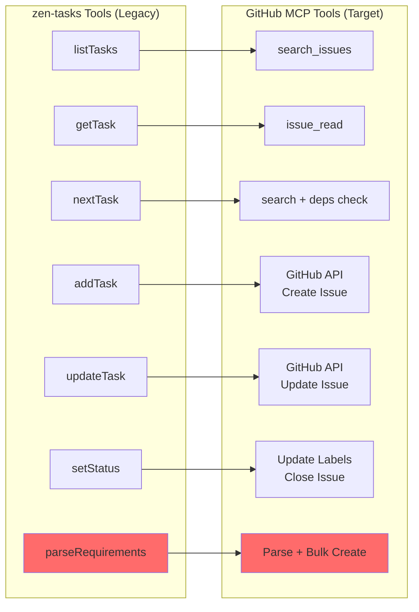

---

## 5-Week Migration Timeline

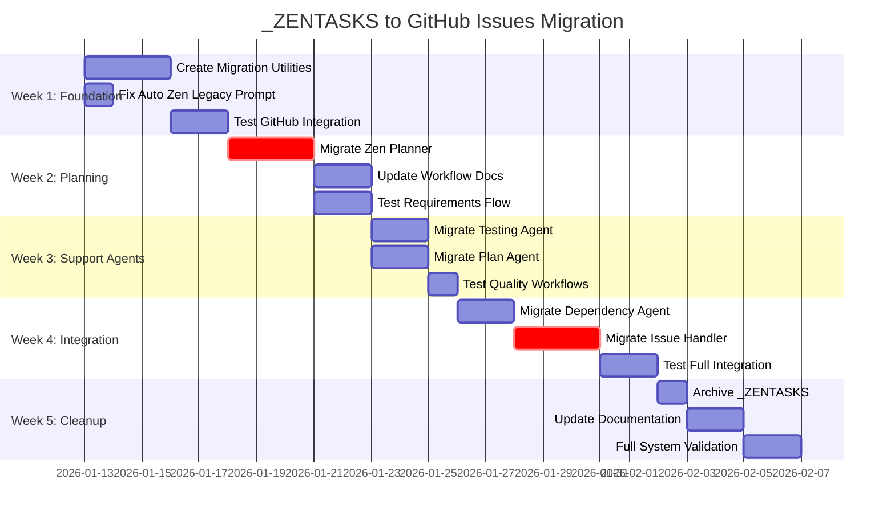

---

## Critical Path Analysis

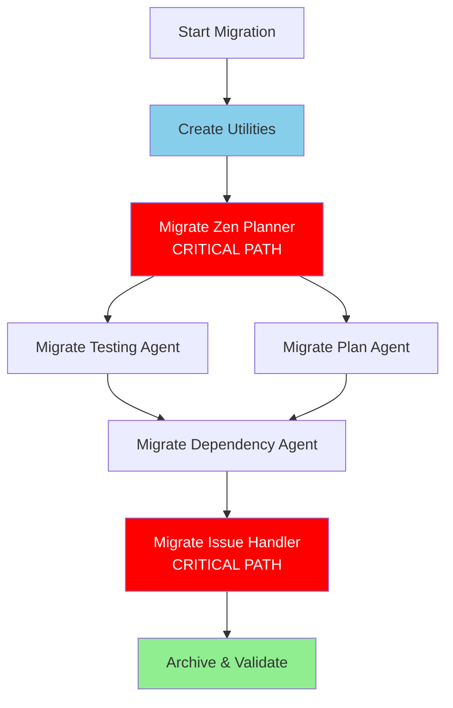

---

## Risk Heatmap

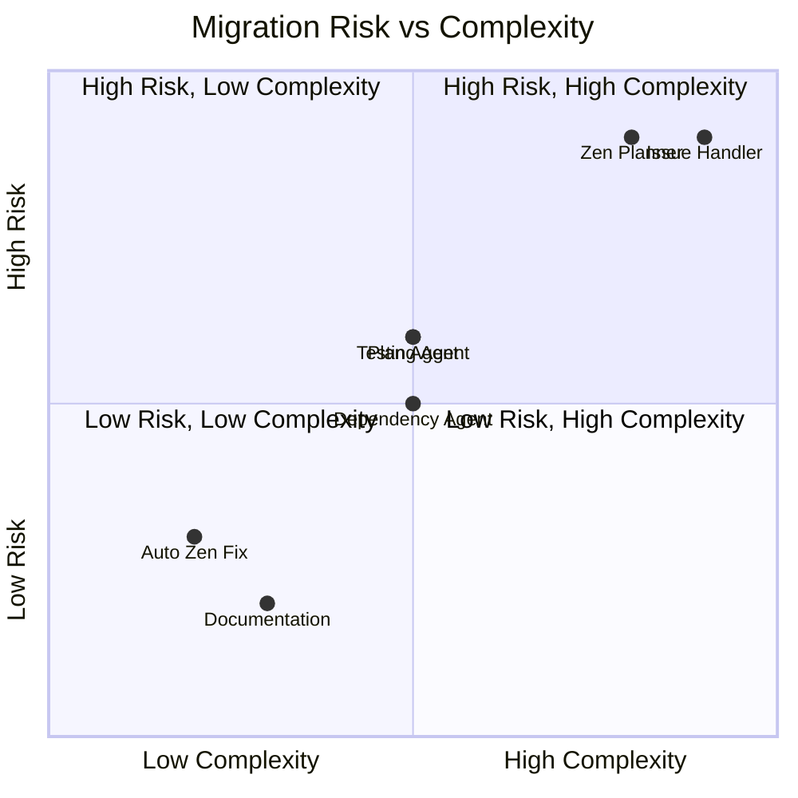

---

## Data Flow: Before vs After

### Before (Legacy System)
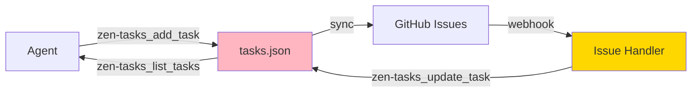

### After (Target System)
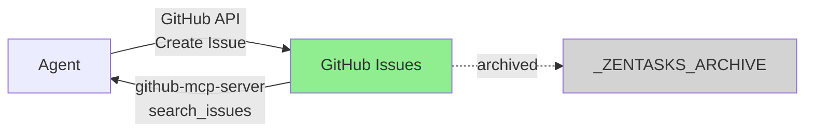

---

## Success Metrics Dashboard

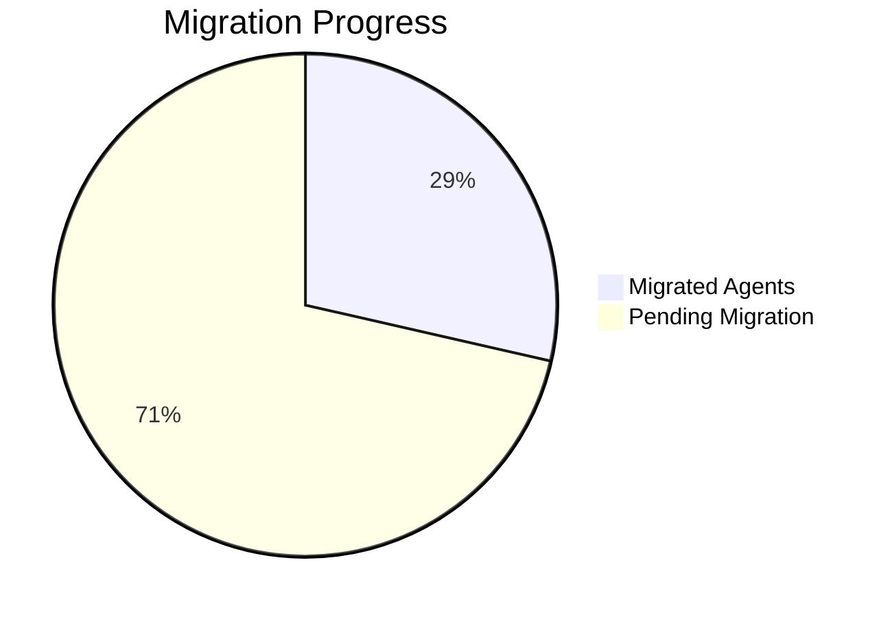

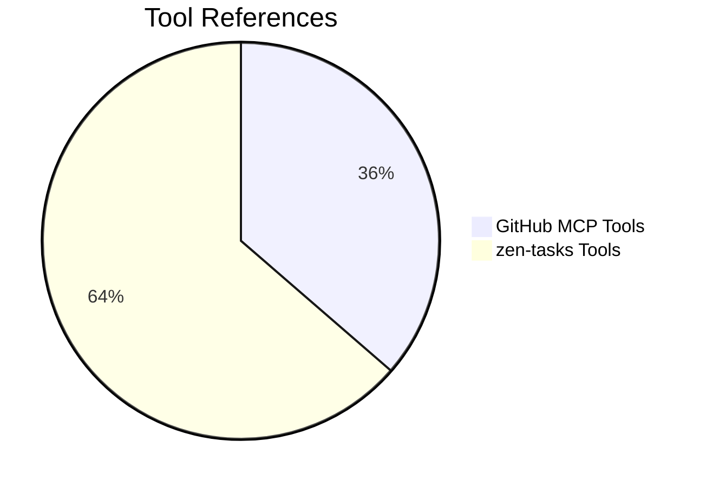

---

## Reference Counts by Category

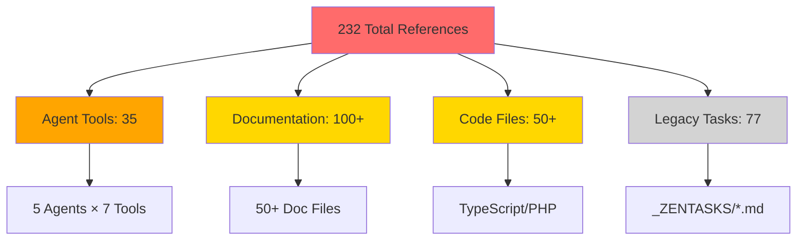

---

## Agent Tool Usage Matrix

| Agent | Tools Count | Status | Priority |
|-------|-------------|--------|----------|
| Auto Zen | 0 | 🟡 Partial | HIGH |
| Cloud Agent | 0 | ✅ Complete | - |
| Zen Planner | 7 | 🔴 Blocked | CRITICAL |
| Testing Agent | 7 | 🔴 Blocked | HIGH |
| Plan Agent | 7 | 🔴 Blocked | MEDIUM |
| Issue Handler | 7 | 🔴 Blocked | MEDIUM |
| Dependency Agent | 7 | 🔴 Blocked | MEDIUM |

**Legend**:
- ✅ Complete: Fully migrated to GitHub Issues
- 🟡 Partial: Mostly migrated, minor cleanup needed
- 🔴 Blocked: Not migrated, requires work

---

## Next Steps Flow

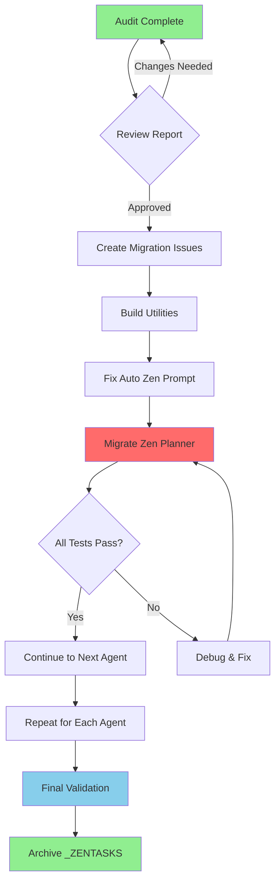

---

**Generated**: 2026-01-12  
**See**: `audit-report.md` for detailed analysis  
**See**: `QUICK-REFERENCE.md` for summary
