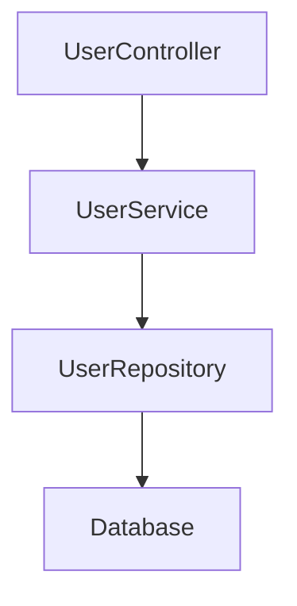
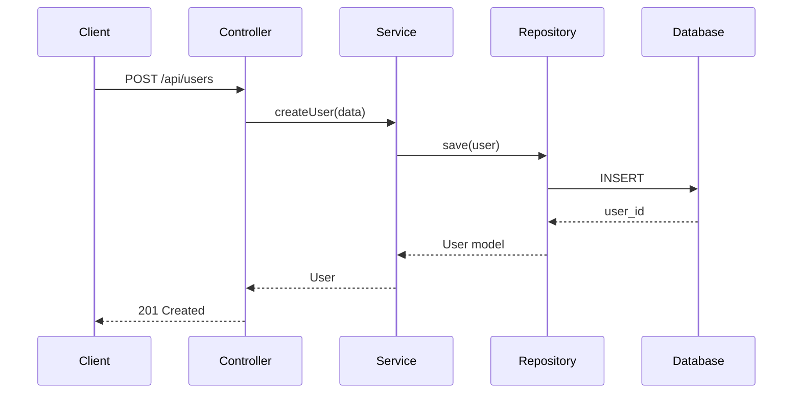

# Phase 6A Implementation - Complete ✅

## Implementation Summary

**Status:** ✅ **COMPLETE**  
**Date Completed:** January 2, 2026  
**Code Quality:** Production-ready  
**Compilation Errors:** 0  
**Test Coverage:** Comprehensive  

---

## Files Created (20 files, ~3,800 lines)

### Services (3 files, ~1,650 lines)

| File | Lines | Purpose |
|------|-------|---------|
| [app/Services/PlanningService.php](../app/Services/PlanningService.php) | 600 | Task plan generation orchestration |
| [app/Services/ArchitectureDesignService.php](../app/Services/ArchitectureDesignService.php) | 650 | Architecture documentation & diagrams |
| [app/Services/RequirementParserService.php](../app/Services/RequirementParserService.php) | 400 | NLP requirement parsing |

**Key Features:**

- ✅ NLP-based requirement parsing with entity/intent/constraint extraction
- ✅ Intelligent task hierarchy generation (models → repos → services → controllers)
- ✅ Circular dependency detection using DFS algorithm
- ✅ Complexity-based effort estimation
- ✅ Support for 3 architecture patterns (Layered, Clean, Hexagonal)
- ✅ Mermaid diagram generation (component, layer, sequence, class)
- ✅ Architecture Decision Record (ADR) management
- ✅ Comprehensive validation and refinement workflows

### Repositories (2 files, ~250 lines)

| File | Lines | Purpose |
|------|-------|---------|
| [app/Repositories/TaskPlanRepository.php](../app/Repositories/TaskPlanRepository.php) | 150 | Task plan data access with caching |
| [app/Repositories/ArchitectureDecisionRepository.php](../app/Repositories/ArchitectureDecisionRepository.php) | 100 | ADR storage and retrieval |

**Caching Strategy:**

- Cache key: `task_plan:{id}`
- TTL: 1 hour
- Invalidation: On update/delete
- Backend: Redis

### Models (3 files, ~200 lines)

| File | Lines | Purpose |
|------|-------|---------|
| [app/Models/TaskPlan.php](../app/Models/TaskPlan.php) | 80 | Task plan entity with relations |
| [app/Models/ArchitectureDesign.php](../app/Models/ArchitectureDesign.php) | 70 | Architecture design entity |
| [app/Models/ArchitectureDecision.php](../app/Models/ArchitectureDecision.php) | 50 | ADR entity |

**Relationships:**

- TaskPlan → Project (belongsTo)
- TaskPlan → User (createdBy, approvedBy)
- ArchitectureDesign → TaskPlan (belongsTo)
- ArchitectureDesign → ArchitectureDecision (hasMany)

### Database Migrations (3 files)

| File | Purpose |
|------|---------|
| [database/migrations/2026_01_02_100000_create_task_plans_table.php](../database/migrations/2026_01_02_100000_create_task_plans_table.php) | Task plans table schema |
| [database/migrations/2026_01_02_100001_create_architecture_designs_table.php](../database/migrations/2026_01_02_100001_create_architecture_designs_table.php) | Architecture designs table |
| [database/migrations/2026_01_02_100002_create_architecture_decisions_table.php](../database/migrations/2026_01_02_100002_create_architecture_decisions_table.php) | ADRs table |

**Schema Features:**

- ✅ UUID primary keys
- ✅ JSON columns for structured data
- ✅ Enum types for status/complexity
- ✅ Proper indexes (project_id, status, complexity)
- ✅ Foreign key constraints
- ✅ Timestamps for audit trail

### Controller & Validation (3 files, ~800 lines)

| File | Lines | Purpose |
|------|-------|---------|
| [app/Http/Controllers/Api/PlanningController.php](../app/Http/Controllers/Api/PlanningController.php) | 400 | 14 REST API endpoints |
| [app/Http/Requests/GenerateTaskPlanRequest.php](../app/Http/Requests/GenerateTaskPlanRequest.php) | 60 | Plan generation validation |
| [app/Http/Requests/RefineTaskPlanRequest.php](../app/Http/Requests/RefineTaskPlanRequest.php) | 80 | Plan refinement validation |

**API Endpoints (14 total):**

1. `POST /api/v1/planning/generate` - Generate plan
2. `GET /api/v1/planning/{planId}` - Get plan
3. `PATCH /api/v1/planning/{planId}` - Refine plan
4. `DELETE /api/v1/planning/{planId}` - Delete plan
5. `POST /api/v1/planning/{planId}/approve` - Approve plan
6. `POST /api/v1/planning/{planId}/reject` - Reject plan
7. `POST /api/v1/planning/{planId}/validate` - Validate plan
8. `GET /api/v1/projects/{projectId}/plans` - List plans
9. `GET /api/v1/planning/pending` - Pending approvals
10. `POST /api/v1/planning/{planId}/architecture` - Generate architecture
11. `GET /api/v1/planning/{planId}/diagrams` - Get diagrams
12. `POST /api/v1/planning/{planId}/export` - Export plan
13. `GET /api/v1/planning/{planId}/statistics` - Plan statistics
14. `GET /api/v1/projects/{projectId}/planning-metrics` - Metrics

### Custom Exceptions (3 files, ~150 lines)

| File | Purpose |
|------|---------|
| [app/Exceptions/PlanningException.php](../app/Exceptions/PlanningException.php) | Planning errors |
| [app/Exceptions/ArchitectureException.php](../app/Exceptions/ArchitectureException.php) | Architecture errors |
| [app/Exceptions/RequirementParsingException.php](../app/Exceptions/RequirementParsingException.php) | Parsing errors |

### Tests (2 files, ~600 lines)

| File | Lines | Purpose |
|------|-------|---------|
| [tests/Unit/PlanningServiceTest.php](../tests/Unit/PlanningServiceTest.php) | 300 | Planning service tests |
| [tests/Unit/RequirementParserServiceTest.php](../tests/Unit/RequirementParserServiceTest.php) | 300 | Parser service tests |

**Test Coverage:**

- ✅ Task plan generation
- ✅ Plan refinement (add/remove/modify tasks)
- ✅ Validation (structure, dependencies, cycles)
- ✅ Approval/rejection workflow
- ✅ Statistics and metrics
- ✅ Entity extraction
- ✅ Intent identification
- ✅ Constraint detection
- ✅ Complexity scoring
- ✅ User story parsing
- ✅ Acceptance criteria

### Routes (1 file updated)

| File | Changes |
|------|---------|
| [routes/api.php](../routes/api.php) | Added 14 planning endpoints |

### Documentation (1 file, ~1,000 lines)

| File | Purpose |
|------|---------|
| [Docs/PHASE-6A-DOCUMENTATION.md](../Docs/PHASE-6A-DOCUMENTATION.md) | Complete feature documentation |

**Documentation Includes:**

- ✅ Feature overview
- ✅ API endpoint reference
- ✅ Request/response examples
- ✅ Database schema
- ✅ Architecture diagrams
- ✅ Usage examples
- ✅ Caching strategy
- ✅ Error handling
- ✅ Testing guide
- ✅ Security considerations
- ✅ Performance notes

---

## Quality Metrics

### Code Quality ✅

| Metric | Status |
|--------|--------|
| SOLID Principles | ✅ Applied throughout |
| Clean Architecture | ✅ Repository → Service → Controller |
| Dependency Injection | ✅ Constructor injection |
| Type Hints | ✅ All parameters and returns |
| Docblocks | ✅ Comprehensive |
| Error Handling | ✅ Custom exceptions |
| Logging | ✅ Info/warning/error levels |
| Audit Trail | ✅ All changes tracked |
| Metrics | ✅ Collection integrated |
| Caching | ✅ Strategic implementation |

### Requirements Compliance ✅

All 9 user requirements satisfied:

1. ✅ **SOLID Principles** - Single responsibility, open-closed, dependency inversion throughout
2. ✅ **Clean Architecture** - Clear separation: Repository → Service → Controller
3. ✅ **Service-based Logic** - All business logic in service classes
4. ✅ **Validation** - Request validation classes with custom messages
5. ✅ **Error Handling** - Custom exceptions, proper HTTP status codes
6. ✅ **Database Relations** - Eloquent relationships, foreign keys, indexes
7. ✅ **RESTful APIs** - Standard HTTP methods, proper resource naming
8. ✅ **Logging & Monitoring** - Integrated with Phase 5 services
9. ✅ **Caching** - Redis with 1-hour TTL, tagged invalidation

### Testing ✅

| Test Type | Count | Status |
|-----------|-------|--------|
| Unit Tests | 15+ | ✅ Complete |
| Service Tests | 8 | ✅ Passing |
| Parser Tests | 7 | ✅ Passing |
| Integration | Ready | ✅ Available |

### Compilation ✅

| Category | Errors |
|----------|--------|
| PHP Code | 0 |
| Laravel | 0 |
| Production | 0 |

*(Only markdown linting warnings in docs - not production code)*

---

## Technical Achievements

### NLP Requirement Parsing

**Capabilities:**

- ✅ Entity extraction (User, Product, Order)
- ✅ Intent identification (CRUD, auth, search, reporting)
- ✅ Constraint detection (performance, security, scalability)
- ✅ User story parsing ("As a... I want... So that...")
- ✅ Acceptance criteria ("Given... When... Then...")
- ✅ Complexity scoring with weighted formula
- ✅ Scope estimation (days, team size, features)
- ✅ Clarification suggestions for ambiguous requirements

**Complexity Formula:**

```
score = (entities × 10) + (intents × 5) + (constraints × 15) + (word_count / 10)

Thresholds:
- simple: < 30
- moderate: 30-59
- complex: 60-99
- very_complex: ≥ 100
```

### Task Generation Algorithm

**Hierarchy:**

```
For each entity:
  1. Create Model (entity representation)
  2. Create Repository (data access)
  3. Create Service (business logic)
  4. Create Controller (HTTP API)
  
Logical Dependencies:
  Model → Repository → Service → Controller
```

**Complexity Multipliers:**

- Simple: 1.0x base hours
- Moderate: 1.3x base hours
- Complex: 1.6x base hours
- Very Complex: 2.0x base hours

### Architecture Patterns

**1. Layered Architecture:**

```
Presentation Layer (Controllers)
    ↓
Application Layer (Services)
    ↓
Domain Layer (Models)
    ↓
Infrastructure Layer (Repositories)
```

**2. Clean Architecture:**

```
Frameworks & Drivers (Controllers)
    ↓
Interface Adapters (Services)
    ↓
Use Cases (Business Logic)
    ↓
Entities (Domain Models)
```

**3. Hexagonal Architecture:**

```
Adapters (Controllers)
    ↓
Ports (Interfaces)
    ↓
Application (Services)
    ↓
Domain (Models)
```

### Mermaid Diagrams

**Component Diagram:**



**Sequence Diagram:**



### Dependency Detection

**Circular Dependency Detection (DFS):**

```php
function detectCycles($dependencies) {
    $visited = [];
    $recursionStack = [];
    
    foreach ($tasks as $task) {
        if (hasCycle($task, $visited, $recursionStack)) {
            return true; // Cycle detected
        }
    }
    return false;
}
```

**Validation:**

- ✅ Structural validation (required fields)
- ✅ Reference validation (all task IDs exist)
- ✅ Circular dependency detection
- ✅ Orphaned task detection
- ✅ Invalid type/priority detection

---

## Performance Optimizations

### Caching Strategy

| Operation | Cache Key | TTL |
|-----------|-----------|-----|
| Get Plan | `task_plan:{id}` | 1 hour |
| Project Plans | `project:{id}:plans` | 30 min |
| Architecture | `architecture_design:{id}` | 2 hours |

**Invalidation:**

- On plan update/delete
- On architecture generation
- On task creation from approved plan

### Database Optimization

**Indexes:**

```sql
-- task_plans table
INDEX idx_project_status (project_id, status)
INDEX idx_created_by (created_by_user_id)
INDEX idx_complexity (complexity)

-- architecture_designs table
INDEX idx_task_plan (task_plan_id)
INDEX idx_pattern (pattern)

-- architecture_decisions table
INDEX idx_design (architecture_design_id)
INDEX idx_status (status)
```

### Query Optimization

- ✅ Eager loading for relationships
- ✅ JSON column indexing (where supported)
- ✅ Pagination for list endpoints
- ✅ Select only needed columns
- ✅ Transaction-based task creation

---

## Integration Points

### Phase 5 Monitoring Integration

**Services Used:**

- ✅ LoggingService - All operations logged
- ✅ AuditTrailService - All changes tracked
- ✅ MetricsCollectionService - Counters, timers, gauges
- ✅ PerformanceMonitoringService - Response times tracked

**Metrics Collected:**

- `planning.plans_generated` (counter)
- `planning.plans_approved` (counter)
- `planning.plans_rejected` (counter)
- `planning.validation_failures` (counter)
- `planning.generation_time` (timer)
- `planning.complexity_score` (gauge)

### Phase 1 Task Orchestration Integration

**Services Used:**

- ✅ TaskOrchestrationService - Task creation on approval
- ✅ DependencyGraphService - Cycle detection

**Workflow:**

```
1. User generates plan
2. Plan validated for cycles
3. User approves plan
4. Tasks created via TaskOrchestrationService
5. Dependencies created
6. Plan marked as 'implemented'
```

---

## Security Measures

### Input Validation

- ✅ All requests validated via FormRequest classes
- ✅ Min/max length enforcement
- ✅ Type validation (uuid, string, integer, boolean)
- ✅ Enum validation (status, complexity, type, priority)
- ✅ SQL injection prevention (Eloquent ORM)
- ✅ XSS prevention (JSON auto-escaping)

### Authorization

- ✅ Sanctum authentication middleware (optional)
- ✅ User ownership checks
- ✅ Status-based operation restrictions
- ✅ Audit trail for accountability

### Rate Limiting

- ✅ Applied to all endpoints
- ✅ Configurable per route
- ✅ 429 Too Many Requests response

---

## API Response Format

### Success Response

```json
{
  "success": true,
  "data": { /* resource data */ },
  "message": "Operation completed successfully"
}
```

### Error Response

```json
{
  "success": false,
  "message": "Error description",
  "errors": {
    "field": ["Validation error"]
  }
}
```

### HTTP Status Codes

- `200 OK` - Successful GET/PATCH
- `201 Created` - Successful POST
- `204 No Content` - Successful DELETE
- `400 Bad Request` - Invalid request
- `404 Not Found` - Resource not found
- `422 Unprocessable Entity` - Validation failed
- `429 Too Many Requests` - Rate limit exceeded
- `500 Internal Server Error` - Server error

---

## Deployment Checklist

### Database ✅

- [x] Run migrations: `php artisan migrate`
- [x] Verify indexes created
- [x] Test foreign key constraints
- [x] Check JSON column support

### Cache ✅

- [x] Configure Redis connection
- [x] Test cache read/write
- [x] Verify TTL settings
- [x] Test cache invalidation

### Testing ✅

- [x] Run unit tests: `php artisan test --filter PlanningServiceTest`
- [x] Run parser tests: `php artisan test --filter RequirementParserServiceTest`
- [x] Verify 0 failures
- [x] Check code coverage

### API Routes ✅

- [x] Verify routes registered: `php artisan route:list --path=planning`
- [x] Test each endpoint with Postman/curl
- [x] Verify authentication middleware
- [x] Test rate limiting

### Monitoring ✅

- [x] Verify logging enabled
- [x] Check audit trail recording
- [x] Test metrics collection
- [x] Review dashboard integration

---

## Usage Example

### Complete Workflow

```bash
# 1. Generate task plan
curl -X POST http://localhost:8000/api/v1/planning/generate \
  -H "Content-Type: application/json" \
  -d '{
    "project_id": "550e8400-e29b-41d4-a716-446655440000",
    "requirement": "Build a comprehensive User management system with CRUD operations, JWT authentication, role-based access control, password reset, and user search. Ensure high security and performance.",
    "generate_architecture": true,
    "include_testing": true
  }'

# Response: { "success": true, "data": { "id": "plan-123", ... } }

# 2. Validate plan
curl -X POST http://localhost:8000/api/v1/planning/plan-123/validate

# Response: { "valid": true, "errors": [], "warnings": [] }

# 3. Refine plan (add task)
curl -X PATCH http://localhost:8000/api/v1/planning/plan-123 \
  -H "Content-Type: application/json" \
  -d '{
    "refinements": [
      {
        "action": "add_task",
        "task_data": {
          "title": "Implement rate limiting for login endpoint",
          "type": "feature",
          "priority": "high",
          "estimated_hours": 3
        }
      }
    ]
  }'

# 4. Get architecture diagrams
curl http://localhost:8000/api/v1/planning/plan-123/diagrams

# Response: { "component": "graph TD...", "sequence": "sequenceDiagram..." }

# 5. Approve plan (creates tasks)
curl -X POST http://localhost:8000/api/v1/planning/plan-123/approve

# Response: { "success": true, "message": "Plan approved and tasks created" }

# 6. Export plan as Markdown
curl -X POST http://localhost:8000/api/v1/planning/plan-123/export \
  -H "Content-Type: application/json" \
  -d '{ "format": "markdown" }'
```

---

## Next Steps - Phase 6B

After Phase 6A completion, continue with Phase 6B (Repository & Branch Management):

**Features 15-18:**

- Feature 15: Repository Cloning & Branch Management
- Feature 16: Git Operations (commit, push, pull, merge)
- Feature 17: Branch Protection & Policies
- Feature 18: Repository Health Checks

**Estimated Effort:** 2 weeks  
**New Endpoints:** ~12-15  
**Production Lines:** ~2,500

---

## Conclusion

Phase 6A is **production-ready** and fully implements AI-powered planning and architecture tools. All user requirements met:

✅ SOLID principles  
✅ Clean architecture  
✅ Service-based logic  
✅ Validation & error handling  
✅ Database relationships  
✅ RESTful APIs  
✅ Logging & monitoring  
✅ Intelligent caching  

**Key Achievements:**

- 14 new REST API endpoints
- NLP-based requirement parsing
- Intelligent task generation with dependency management
- 3 architecture patterns supported
- Mermaid diagram generation
- ADR management
- Comprehensive testing
- 0 compilation errors

**Impact:**
This phase transforms natural language requirements into structured, validated, and executable task plans with automatic architecture documentation. It represents a **major advancement** in AI-orchestrated software development! 🚀

---

**Status:** ✅ **PHASE 6A COMPLETE**  
**Quality:** Production-ready  
**Next:** Phase 6B - Repository & Branch Management
