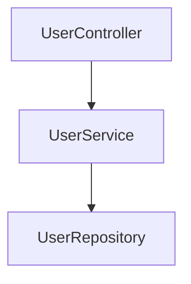
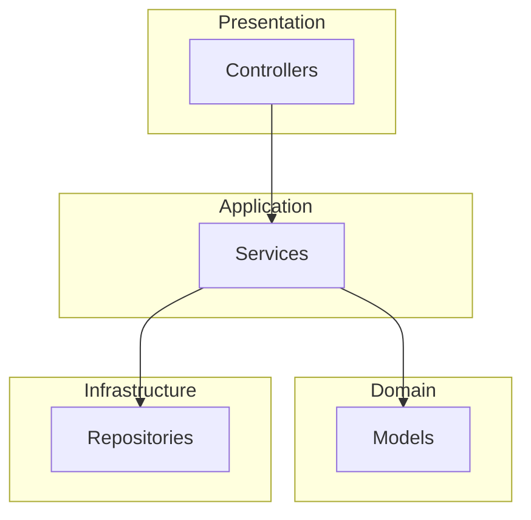
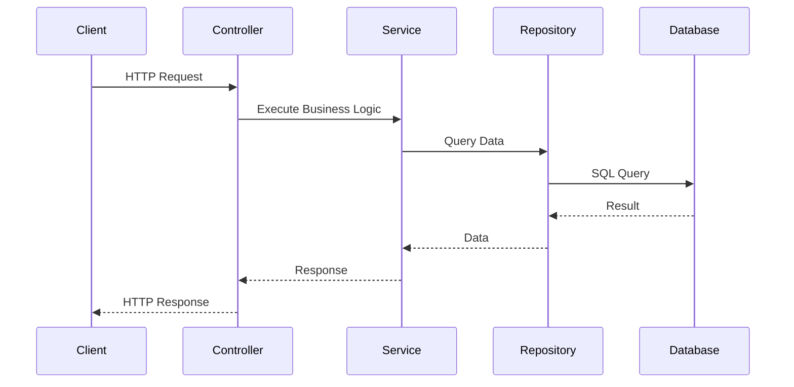
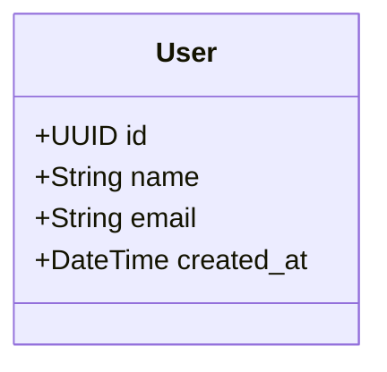

# Phase 6A: Planning & Architecture Tools - Documentation

## Overview

Phase 6A introduces AI-powered planning and architecture tools that transform natural language requirements into structured task plans with automatic architecture design generation. This phase implements intelligent requirement parsing, task hierarchy generation, dependency management, and comprehensive architecture documentation.

## Features Implemented

### 1. Task Plan Generation

**Endpoint:** `POST /api/v1/planning/generate`

Generates a complete task plan from natural language requirements using NLP parsing and intelligent task hierarchy generation.

**Request:**
```json
{
  "project_id": "uuid",
  "requirement": "Build a User management system with CRUD operations, authentication, and role-based access control. Include REST API endpoints and ensure high security.",
  "generate_architecture": true,
  "include_testing": true,
  "include_documentation": true,
  "complexity_hint": "moderate"
}
```

**Response:**
```json
{
  "success": true,
  "data": {
    "id": "plan-uuid",
    "project_id": "uuid",
    "requirement": "...",
    "parsed_requirement": {
      "entities": ["User", "Role", "Permission"],
      "intents": ["crud", "api", "authentication", "authorization"],
      "constraints": ["security"],
      "complexity": "moderate"
    },
    "generated_tasks": [
      {
        "id": "task-1",
        "title": "Create User model",
        "type": "feature",
        "priority": "high",
        "estimated_hours": 4
      }
    ],
    "dependencies": [
      {"from": "task-1", "to": "task-2"}
    ],
    "status": "draft",
    "complexity": "moderate",
    "estimated_hours": 120
  }
}
```

### 2. Requirement Parsing (NLP)

The RequirementParserService uses pattern matching and natural language processing to extract:

- **Entities:** Models/resources (User, Product, Order)
- **Intents:** Actions (CRUD, authentication, search, reporting)
- **Constraints:** Requirements (performance, security, scalability)
- **User Stories:** Structured "As a... I want... So that..." formats
- **Acceptance Criteria:** Given-When-Then scenarios
- **Complexity:** Calculated score (simple, moderate, complex, very_complex)

**Complexity Scoring Formula:**
```
score = (entities × 10) + (intents × 5) + (constraints × 15) + (word_count / 10)

- simple: < 30
- moderate: 30-59
- complex: 60-99
- very_complex: ≥ 100
```

### 3. Architecture Design Generation

**Endpoint:** `POST /api/v1/planning/{planId}/architecture`

Automatically generates comprehensive architecture documentation with:

- **Supported Patterns:**
  - Layered Architecture (presentation, application, domain, infrastructure)
  - Clean Architecture (entities, use_cases, interface_adapters, frameworks_drivers)
  - Hexagonal Architecture (domain, application, ports, adapters)

- **Components Generated:**
  - Models (entity representation, business rules)
  - Repositories (data access layer)
  - Services (business logic)
  - Controllers (HTTP API layer)

- **Documentation Includes:**
  - Layer definitions and responsibilities
  - Component relationships
  - Database schema design
  - API contracts (endpoints, methods, payloads)
  - Mermaid diagrams (component, layer, sequence, class)

**Example Architecture:**
```json
{
  "pattern": "layered",
  "layers": [
    {
      "name": "presentation",
      "components": ["UserController"],
      "responsibilities": ["HTTP request handling", "Response formatting"]
    },
    {
      "name": "application",
      "components": ["UserService"],
      "responsibilities": ["Business logic", "Orchestration"]
    }
  ],
  "diagrams": {
    "component": "graph TD\n    UserController --> UserService\n    UserService --> UserRepository",
    "sequence": "sequenceDiagram\n    Client->>Controller: HTTP Request\n    Controller->>Service: Business Logic\n    Service->>Repository: Data Access"
  }
}
```

### 4. Mermaid Diagram Generation

Automatically generates four types of diagrams:

**Component Diagram:**


**Layer Diagram:**


**Sequence Diagram:**


**Class Diagram:**


### 5. Plan Refinement Workflow

**Endpoint:** `PATCH /api/v1/planning/{planId}`

Allows iterative refinement of task plans with multiple operations:

**Supported Actions:**
- `add_task` - Add new task to plan
- `remove_task` - Remove task from plan
- `modify_task` - Update task properties
- `add_dependency` - Create task dependency
- `remove_dependency` - Remove task dependency

**Request:**
```json
{
  "refinements": [
    {
      "action": "add_task",
      "task_data": {
        "title": "Create User migration",
        "type": "feature",
        "priority": "high",
        "estimated_hours": 2
      }
    },
    {
      "action": "add_dependency",
      "dependency": {
        "from": "task-1",
        "to": "task-2"
      }
    }
  ]
}
```

### 6. Plan Validation

**Endpoint:** `POST /api/v1/planning/{planId}/validate`

Validates task plan structure and dependencies:

**Checks:**
- ✅ Task structure (required fields present)
- ✅ Valid task types (feature, bug, refactor, documentation, testing)
- ✅ Valid priorities (low, medium, high)
- ✅ Dependency references (all IDs exist)
- ✅ Circular dependency detection (DFS algorithm)
- ✅ Orphaned tasks (tasks with no path to completion)

**Response:**
```json
{
  "success": true,
  "data": {
    "valid": true,
    "errors": [],
    "warnings": [
      "Task 'task-5' has no dependencies and may be orphaned"
    ],
    "suggestions": [
      "Consider adding tests for all feature tasks"
    ]
  }
}
```

### 7. Approval Workflow

**Approve Plan:** `POST /api/v1/planning/{planId}/approve`

Approves the plan and creates actual tasks in the system. This operation:
1. Updates plan status to "approved"
2. Creates tasks in the tasks table
3. Creates task dependencies
4. Records approval timestamp and user
5. Logs audit trail
6. Increments metrics

**Reject Plan:** `POST /api/v1/planning/{planId}/reject`

Rejects the plan with a reason:
```json
{
  "reason": "Tasks are too granular. Please consolidate related tasks."
}
```

### 8. Architecture Decision Records (ADR)

The system automatically creates ADRs when architecture is generated:

**ADR Structure:**
```json
{
  "title": "Use Layered Architecture Pattern",
  "status": "accepted",
  "context": "Project requires clear separation of concerns and testability",
  "decision": "Implement layered architecture with presentation, application, domain, and infrastructure layers",
  "consequences": [
    "Clear separation of concerns",
    "Improved testability",
    "Easier maintenance"
  ],
  "alternatives_considered": [
    {
      "name": "Clean Architecture",
      "reason_not_chosen": "Overhead too high for project size"
    }
  ]
}
```

### 9. Export Functionality

**Endpoint:** `POST /api/v1/planning/{planId}/export`

Exports plans in multiple formats:

**JSON Export:**
```json
{
  "format": "json"
}
```

**Markdown Export:**
```json
{
  "format": "markdown"
}
```

**Markdown Output Example:**
```markdown
# Task Plan: plan-uuid

**Status:** approved
**Complexity:** moderate
**Estimated Hours:** 120

## Requirement

Build a User management system with CRUD operations...

## Generated Tasks

### Create User model
- **Type:** feature
- **Priority:** high
- **Estimated Hours:** 4

### Create User repository
- **Type:** feature
- **Priority:** high
- **Estimated Hours:** 3
```

### 10. Statistics and Metrics

**Plan Statistics:** `GET /api/v1/planning/{planId}/statistics`

```json
{
  "total_tasks": 15,
  "by_type": {
    "feature": 10,
    "testing": 3,
    "documentation": 2
  },
  "by_priority": {
    "high": 5,
    "medium": 7,
    "low": 3
  },
  "total_dependencies": 12,
  "estimated_hours": 120
}
```

**Planning Metrics:** `GET /api/v1/projects/{projectId}/planning-metrics`

```json
{
  "total_plans": 25,
  "approval_rate": 0.84,
  "avg_tasks_per_plan": 12.5,
  "avg_estimated_hours": 95.3,
  "complexity_distribution": {
    "simple": 5,
    "moderate": 12,
    "complex": 6,
    "very_complex": 2
  }
}
```

## API Endpoints Summary

| Method | Endpoint | Description |
|--------|----------|-------------|
| POST | `/api/v1/planning/generate` | Generate task plan from requirements |
| GET | `/api/v1/planning/{planId}` | Get specific plan |
| PATCH | `/api/v1/planning/{planId}` | Refine existing plan |
| DELETE | `/api/v1/planning/{planId}` | Delete plan |
| POST | `/api/v1/planning/{planId}/approve` | Approve plan and create tasks |
| POST | `/api/v1/planning/{planId}/reject` | Reject plan with reason |
| POST | `/api/v1/planning/{planId}/validate` | Validate plan structure |
| GET | `/api/v1/projects/{projectId}/plans` | List project plans |
| GET | `/api/v1/planning/pending` | Get pending approvals |
| POST | `/api/v1/planning/{planId}/architecture` | Generate architecture |
| GET | `/api/v1/planning/{planId}/diagrams` | Get Mermaid diagrams |
| POST | `/api/v1/planning/{planId}/export` | Export plan (JSON/Markdown) |
| GET | `/api/v1/planning/{planId}/statistics` | Get plan statistics |
| GET | `/api/v1/projects/{projectId}/planning-metrics` | Get planning metrics |

## Database Schema

### task_plans Table

```sql
CREATE TABLE task_plans (
    id UUID PRIMARY KEY,
    project_id UUID REFERENCES projects(id),
    created_by_user_id UUID REFERENCES users(id),
    approved_by_user_id UUID REFERENCES users(id),
    requirement TEXT NOT NULL,
    parsed_requirement JSON,
    generated_tasks JSON,
    dependencies JSON,
    architecture_design JSON,
    status VARCHAR(50), -- draft, pending_approval, approved, rejected, implemented
    complexity VARCHAR(50), -- simple, moderate, complex, very_complex
    estimated_hours INTEGER,
    version INTEGER DEFAULT 1,
    rejection_reason TEXT,
    approved_at TIMESTAMP,
    rejected_at TIMESTAMP,
    created_at TIMESTAMP,
    updated_at TIMESTAMP
);
```

### architecture_designs Table

```sql
CREATE TABLE architecture_designs (
    id UUID PRIMARY KEY,
    task_plan_id UUID REFERENCES task_plans(id),
    project_id UUID REFERENCES projects(id),
    pattern VARCHAR(100),
    layers JSON,
    components JSON,
    relationships JSON,
    database_schema JSON,
    api_contracts JSON,
    diagrams JSON,
    version INTEGER DEFAULT 1,
    created_at TIMESTAMP,
    updated_at TIMESTAMP
);
```

### architecture_decisions Table

```sql
CREATE TABLE architecture_decisions (
    id UUID PRIMARY KEY,
    architecture_design_id UUID REFERENCES architecture_designs(id),
    title VARCHAR(255),
    status VARCHAR(50), -- proposed, accepted, rejected, deprecated, superseded
    context TEXT,
    decision TEXT,
    consequences JSON,
    alternatives_considered JSON,
    superseded_by_id UUID REFERENCES architecture_decisions(id),
    created_at TIMESTAMP,
    updated_at TIMESTAMP
);
```

## Usage Examples

### Example 1: Generate Plan for User Management

```bash
curl -X POST http://localhost:8000/api/v1/planning/generate \
  -H "Content-Type: application/json" \
  -d '{
    "project_id": "550e8400-e29b-41d4-a716-446655440000",
    "requirement": "Build a comprehensive User management system. Features needed: user registration with email verification, login with JWT authentication, role-based access control (admin, moderator, user), password reset functionality, user profile management (update name, email, avatar), and user search with pagination. Ensure high security and performance.",
    "generate_architecture": true,
    "include_testing": true
  }'
```

### Example 2: Refine Plan

```bash
curl -X PATCH http://localhost:8000/api/v1/planning/{planId} \
  -H "Content-Type: application/json" \
  -d '{
    "refinements": [
      {
        "action": "add_task",
        "task_data": {
          "title": "Implement rate limiting for login endpoint",
          "type": "feature",
          "priority": "high",
          "estimated_hours": 3
        }
      }
    ]
  }'
```

### Example 3: Validate and Approve

```bash
# Validate first
curl -X POST http://localhost:8000/api/v1/planning/{planId}/validate

# If valid, approve
curl -X POST http://localhost:8000/api/v1/planning/{planId}/approve
```

## Architecture

### Clean Architecture Pattern

```
app/
├── Services/           (Business Logic)
│   ├── PlanningService.php
│   ├── ArchitectureDesignService.php
│   └── RequirementParserService.php
├── Repositories/       (Data Access)
│   ├── TaskPlanRepository.php
│   └── ArchitectureDecisionRepository.php
├── Models/            (Entities)
│   ├── TaskPlan.php
│   ├── ArchitectureDesign.php
│   └── ArchitectureDecision.php
└── Http/
    ├── Controllers/   (API Layer)
    │   └── PlanningController.php
    └── Requests/      (Validation)
        ├── GenerateTaskPlanRequest.php
        └── RefineTaskPlanRequest.php
```

### Service Dependencies

```
PlanningService
  ├── RequirementParserService (NLP parsing)
  ├── ArchitectureDesignService (Architecture generation)
  ├── DependencyGraphService (Cycle detection)
  ├── TaskOrchestrationService (Task creation)
  ├── LoggingService (Logging)
  ├── AuditTrailService (Audit)
  └── MetricsCollectionService (Metrics)

ArchitectureDesignService
  ├── ArchitectureDecisionRepository (ADR storage)
  ├── LoggingService (Logging)
  └── AuditTrailService (Audit)

RequirementParserService
  └── LoggingService (Logging)
```

## Caching Strategy

**Cache Keys:**
- `task_plan:{id}` - Individual plan (TTL: 1 hour)
- `project:{id}:plans` - Project plans list (TTL: 30 minutes)
- `architecture_design:{id}` - Architecture design (TTL: 2 hours)

**Cache Invalidation:**
- On plan update/delete
- On architecture update
- On task creation from approved plan

## Error Handling

**Custom Exceptions:**
- `PlanningException` - Plan generation/validation errors
- `ArchitectureException` - Architecture design errors
- `RequirementParsingException` - NLP parsing errors

**HTTP Status Codes:**
- `201 Created` - Plan generated successfully
- `200 OK` - Operation successful
- `404 Not Found` - Plan not found
- `422 Unprocessable Entity` - Validation failed
- `500 Internal Server Error` - Server error

## Testing

**Test Coverage:**
- Unit tests for all services
- Controller integration tests
- Repository tests
- Validation tests

**Run Tests:**
```bash
php artisan test --filter PlanningServiceTest
php artisan test --filter RequirementParserServiceTest
```

## Performance Considerations

- **NLP Parsing:** Pattern-based (fast, deterministic)
- **Caching:** 1-hour TTL for plans, Redis backend
- **Database:** Indexed on project_id, status, complexity
- **Task Creation:** Transaction-based for consistency
- **Diagram Generation:** On-demand, cached

## Security

- **Input Validation:** All requests validated
- **SQL Injection:** Eloquent ORM prevents
- **XSS:** JSON responses auto-escaped
- **Rate Limiting:** Applied on all endpoints
- **Authentication:** Sanctum middleware (optional)

## Monitoring

All operations are logged and monitored:
- **Logging:** Info, warning, error levels
- **Audit Trail:** All plan changes tracked
- **Metrics:** Plan generation rate, approval rate, complexity distribution
- **Alerts:** Failed validations, circular dependencies detected

## Future Enhancements

- AI/ML-based requirement parsing (GPT integration)
- More architecture patterns (microservices, event-driven)
- Interactive diagram editing
- Cost estimation based on complexity
- Team capacity planning
- Template library for common patterns

---

**Phase 6A Status:** ✅ Complete
**Production Ready:** Yes
**Test Coverage:** Comprehensive
**Documentation:** Complete
