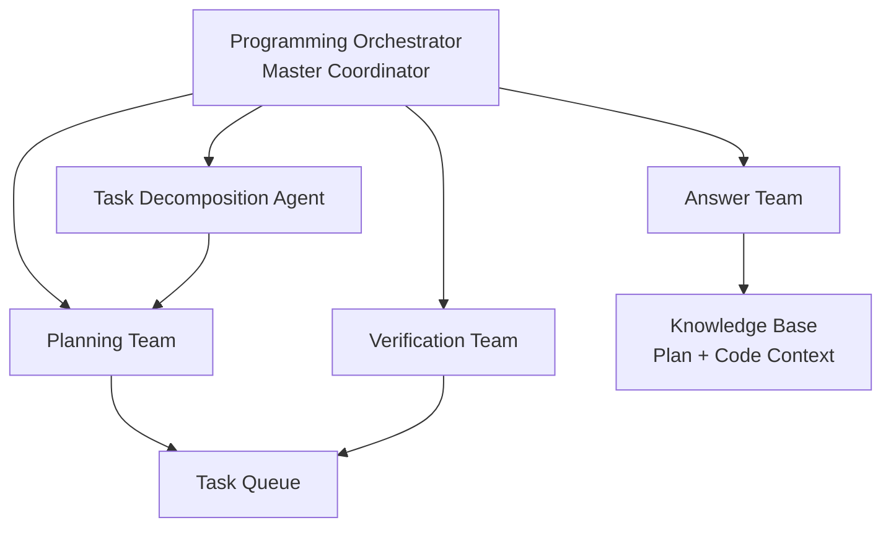
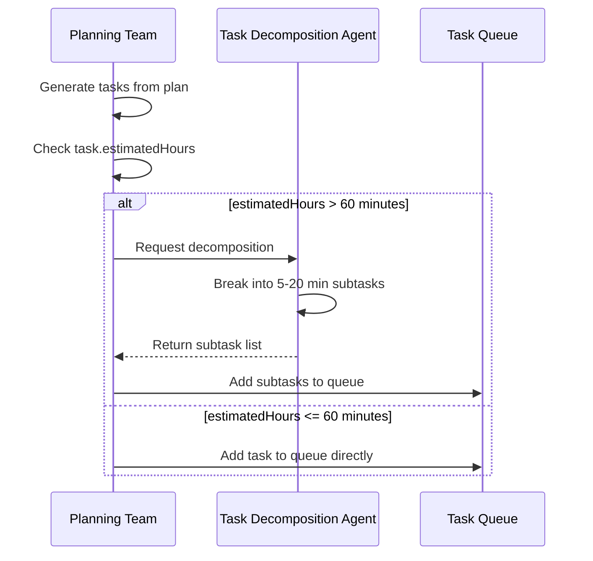
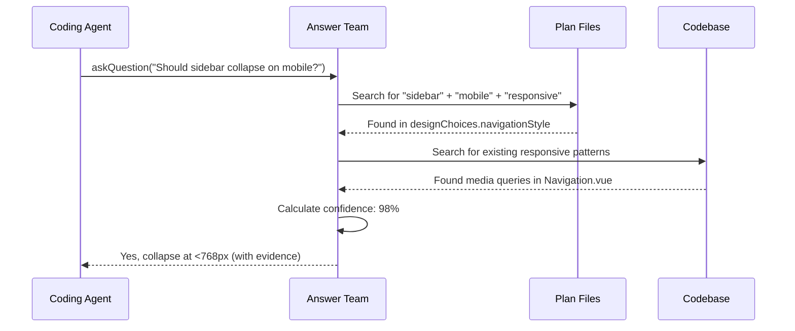
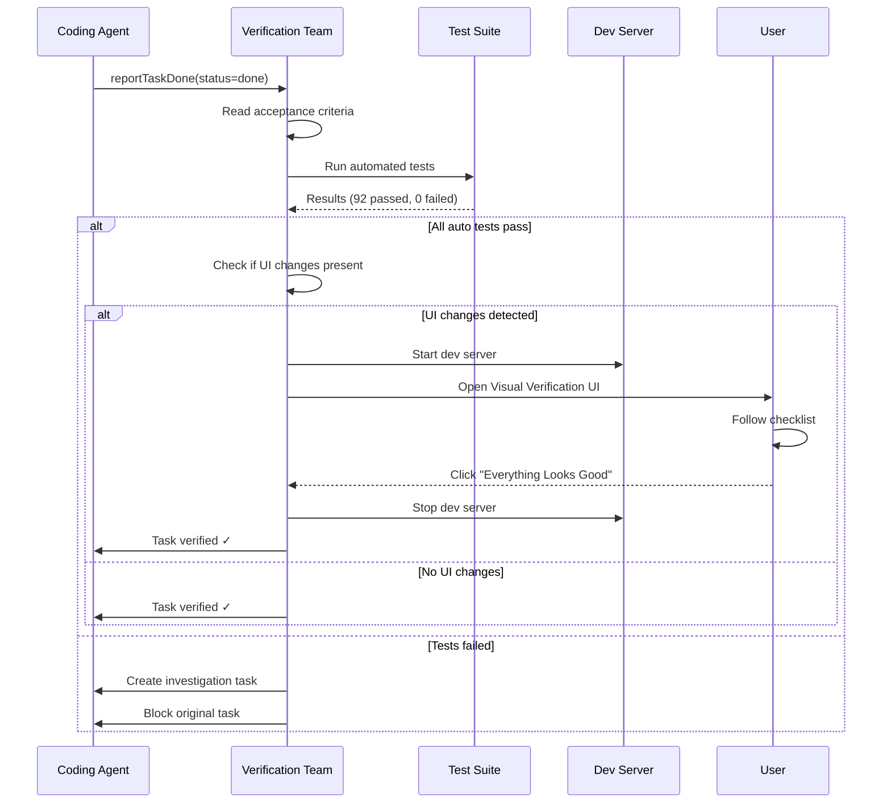
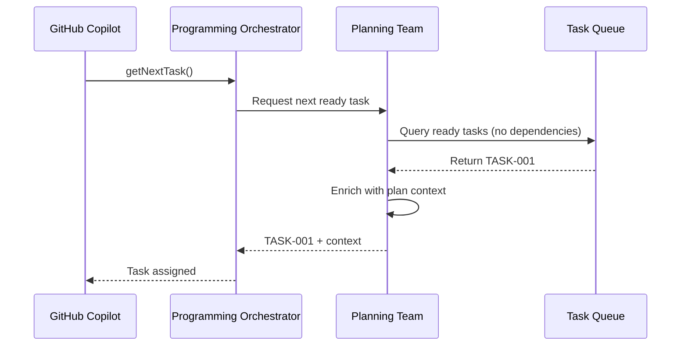
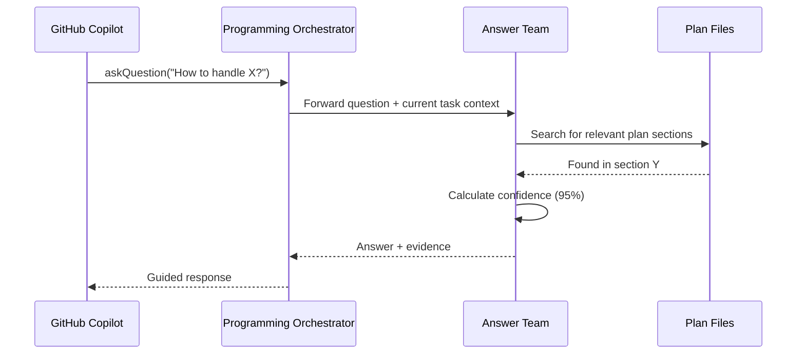
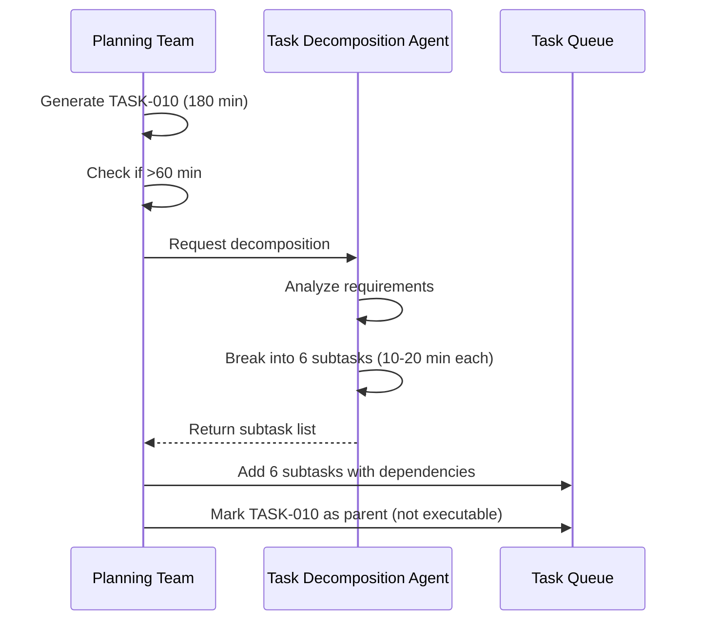
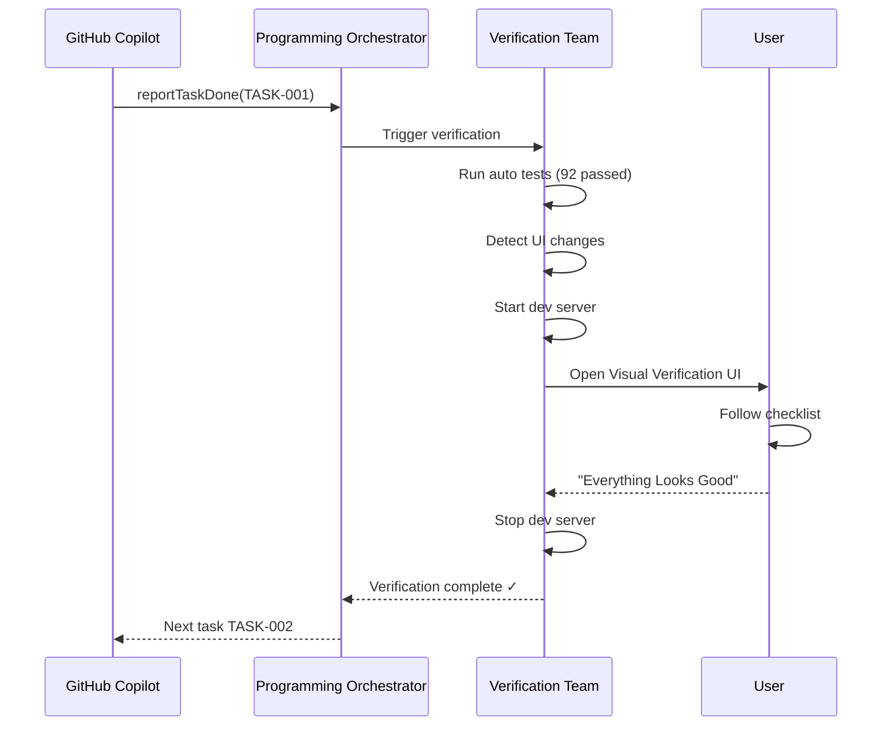

# COE Agent Role Definitions

**Version**: 1.0  
**Date**: January 17, 2026  
**Status**: Draft  
**Cross-References**: [Master Plan](plan.md), [Architecture Document](01-Architecture-Document.md)

---

## Overview

The **Copilot Orchestration Extension** employs a team-based agent architecture where specialized agents handle different aspects of the development workflow. This document defines the roles, responsibilities, interfaces, and coordination patterns for each agent type.

### Agent Hierarchy



---

## Agent 1: Programming Orchestrator

### Role
**Master coordinator** that routes tasks, manages agent lifecycle, and aggregates metrics.

### Responsibilities
- Route tasks to appropriate agent based on task type and status
- Monitor agent health and performance metrics
- Implement fallback strategies when agents fail
- Aggregate metrics for dashboard display
- Handle agent handoffs (e.g., Planning → Decomposition → Verification)
- Maintain agent communication logs for audit

### Goals
- ✅ Ensure every task is assigned to the right agent
- ✅ Minimize agent idle time (keep agents busy)
- ✅ Detect and recover from agent failures within 30 seconds
- ✅ Provide real-time status updates to UI

### Anti-Goals
- ❌ Never execute tasks directly (delegates to specialized agents)
- ❌ Never make plan decisions (defers to Planning Team)
- ❌ Never answer questions (defers to Answer Team)

### Tool Permissions
```yaml
read_files: true              # Read plans, tasks, logs
write_files: false            # Cannot modify plans or tasks
modify_tasks: true            # Can update task assignments
access_network: false         # Local coordination only
run_commands: false           # No direct execution
```

### Execution Constraints
```yaml
max_parallel_agents: 4        # One per team type
require_plan_before_action: true
health_check_interval: 10s    # Check agent heartbeats
fallback_timeout: 30s         # Switch to fallback if agent unresponsive
```

### Handoff Logic
```typescript
function routeTask(task: Task): AgentType {
  // Priority 1: Check if task needs decomposition
  if (task.estimatedHours > 1) {
    return AgentType.TaskDecomposition;
  }
  
  // Priority 2: Check if task is completed and needs verification
  if (task.status === 'done') {
    return AgentType.Verification;
  }
  
  // Priority 3: Check if task requires context/questions
  if (task.requiresContext || task.hasOpenQuestions) {
    return AgentType.Answer;
  }
  
  // Default: Route to Planning Team
  return AgentType.Planning;
}
```

### Metrics Tracked
- Tasks routed per agent type (count)
- Agent response times (avg, p95, p99)
- Agent failure rate (per hour)
- Task completion velocity (tasks/day)
- Queue depth per agent

### Communication Protocol
**Input**: MCP tool calls from GitHub Copilot  
**Output**: Dispatched tasks to specialized agents  
**Format**: JSON-RPC 2.0 over stdio

**Example Dispatch**:
```json
{
  "type": "agent_dispatch",
  "targetAgent": "PlanningTeam",
  "task": {
    "taskId": "TASK-001",
    "action": "generateTasks",
    "planId": "my-app",
    "planVersion": "1.0.0"
  },
  "timeout": 60000,
  "fallback": "NotifyUser"
}
```

---

## Agent 2: Planning Team

### Role
**Task generator and project tracker** that converts plans into executable task trees with dependencies.

### Responsibilities
- Read plan files from `Docs/Plans/{plan-id}/`
- Generate comprehensive task decomposition (epics → stories → subtasks)
- Maintain dependency-aware task graphs (DAG validation)
- Track overall project progress and health
- Identify when plan updates require new tasks
- Coordinate with Task Decomposition Agent for complex work
- Update `tasks.json` with generated tasks

### Goals
- ✅ Convert user plans into complete, dependency-aware task trees
- ✅ Maintain DAG structure (no circular dependencies)
- ✅ Track overall project progress (% complete, blocked count)
- ✅ Identify plan-code drift (when code doesn't match plan)

### Anti-Goals
- ❌ Never implement code directly (delegates to Coding Agent)
- ❌ Never modify plan without user approval (read-only access)
- ❌ Never create tasks not grounded in plan specifications

### Tool Permissions
```yaml
read_files: true              # Read plan.json, metadata.json, design-system.json
write_files: true             # Write tasks.json, TASK-*.md files
modify_tasks: true            # Create, update, delete tasks
access_network: false         # Local only
run_commands: false           # No execution
```

### Execution Constraints
```yaml
require_plan_before_action: true    # Must have valid plan.json
require_context_review: true        # Review plan context before generating tasks
max_parallel_actions: 5             # Can create up to 5 tasks simultaneously
max_task_depth: 3                   # Epics → Stories → Subtasks (3 levels max)
```

### Task Generation Algorithm
```typescript
interface TaskGenerationConfig {
  planId: string;
  planVersion: string;
  maxTaskHours: number;        // Default: 4 hours
  minTaskHours: number;        // Default: 0.5 hours
  estimationBuffer: number;    // Default: 1.2x (20% buffer)
}

async function generateTasks(config: TaskGenerationConfig): Promise<Task[]> {
  // Step 1: Read plan
  const plan = await readPlan(config.planId);
  
  // Step 2: Extract features from designChoices
  const features = extractFeatures(plan.designChoices);
  
  // Step 3: Create epics for major features
  const epics = features.map(feature => createEpic(feature));
  
  // Step 4: Break epics into stories
  const stories = epics.flatMap(epic => breakIntoStories(epic));
  
  // Step 5: Break stories into subtasks
  const subtasks = stories.flatMap(story => breakIntoSubtasks(story));
  
  // Step 6: Assign dependencies based on plan
  const withDependencies = assignDependencies(subtasks, plan);
  
  // Step 7: Validate DAG (no cycles)
  validateDAG(withDependencies);
  
  // Step 8: Write to tasks.json
  await writeTasks(withDependencies);
  
  return withDependencies;
}
```

### Example Task Structure
```json
{
  "taskId": "TASK-001",
  "type": "epic",
  "title": "Implement Color Palette System",
  "description": "Create CSS variables and design tokens from design-system.json",
  "priority": "high",
  "status": "pending",
  "estimatedHours": 8,
  "dependencies": [],
  "subtasks": ["TASK-002", "TASK-003"],
  "acceptanceCriteria": [
    "All colors match design-system.json",
    "CSS variables support light/dark theme",
    "Colors accessible per WCAG AA"
  ],
  "planReference": {
    "planId": "my-app",
    "version": "1.0.0",
    "section": "designChoices.colorTheme"
  },
  "generatedAt": "2026-01-17T10:00:00Z",
  "generatedBy": "PlanningTeam"
}
```

### Coordination with Task Decomposition Agent


### Prompt Templates
```yaml
system: |
  You are the Planning Team agent. Your job is to understand the user's plan
  and break it into a complete, dependency-aware task tree.
  
  Read from: Docs/Plans/{planId}/plan.json
  Write to: Docs/Plans/{planId}/tasks.json and individual TASK-*.md files
  
  When plan updates, analyze impact and create appropriate tasks.
  Coordinate with Task Decomposition agent for complex tasks (>60 min).

planning: |
  Analyze the plan at {{planPath}}.
  Create tasks for all features/requirements.
  Ensure dependencies are correct (no circular references).
  Mark ready tasks with no blockers.
  
  For each feature in designChoices:
  1. Create epic-level task
  2. Break into story-level tasks (user-facing value)
  3. Break stories into subtasks (technical implementation)
  4. Assign dependencies based on plan relationships
  5. Validate DAG structure
  6. Write to tasks.json
```

---

## Agent 3: Answer Team

### Role
**Context-aware Q&A system** that provides answers from plan and codebase for current task.

### Responsibilities
- Read entire codebase with semantic understanding
- Read current plan (all versions)
- Know which task is currently being worked on
- Answer questions specifically related to current task context
- Provide plan references with exact quotes
- Show code examples from existing implementation
- Clarify design decisions from plan history

### Goals
- ✅ Answer questions related to current task with 95%+ accuracy
- ✅ Provide relevant plan sections with exact references
- ✅ Show code examples from codebase when applicable
- ✅ Clarify design decisions with evidence (not guessing)

### Anti-Goals
- ❌ Never implement code (answer-only role)
- ❌ Never modify tasks or plan (read-only access)
- ❌ Never answer questions outside current task scope (stay focused)
- ❌ Never guess - admit uncertainty when answer not in plan/code

### Tool Permissions
```yaml
read_files: true              # Read all plan files + codebase
write_files: false            # Read-only access
modify_tasks: false           # Cannot change tasks
access_network: false         # Local knowledge only
run_commands: false           # No execution
```

### Execution Constraints
```yaml
require_context_review: true      # Must review task + plan before answering
max_depth: 3                      # Can follow references but don't go too deep
max_response_time: 5s             # Must respond within 5 seconds
confidence_threshold: 0.7         # Only answer if confidence >= 70%
```

### Answer Algorithm
```typescript
interface QuestionContext {
  question: string;
  currentTaskId: string;
  currentTask: Task;
  planId: string;
  planVersion: string;
}

async function answerQuestion(context: QuestionContext): Promise<Answer> {
  // Step 1: Search plan for relevant sections
  const planResults = await searchPlan(context.question, context.planId);
  
  // Step 2: Search codebase for similar implementations
  const codeResults = await searchCodebase(context.question);
  
  // Step 3: Combine evidence and calculate confidence
  const evidence = combineEvidence(planResults, codeResults);
  const confidence = calculateConfidence(evidence);
  
  // Step 4: If confidence < threshold, admit uncertainty
  if (confidence < 0.7) {
    return {
      success: true,
      answer: "I'm not certain about this. The plan doesn't clearly specify this detail.",
      confidence: confidence,
      suggestion: "Consider asking the user or checking related documentation."
    };
  }
  
  // Step 5: Format answer with references
  return formatAnswer(evidence, confidence);
}
```

### Example Question Flow


### Answer Format
```json
{
  "success": true,
  "question": "Should sidebar collapse on mobile?",
  "answer": "Yes, sidebar should collapse to hamburger menu on screens < 768px",
  "confidence": 0.98,
  "evidence": {
    "source": "Docs/Plans/my-app/plan.json",
    "planVersion": "1.0.0",
    "section": "designChoices.navigationStyle",
    "exactQuote": "Sidebar collapses to hamburger menu on mobile (< 768px breakpoint)",
    "lineNumbers": [45, 48]
  },
  "guidance": {
    "implementation": "Use media query @media (max-width: 768px) to toggle sidebar visibility",
    "example": "@media (max-width: 768px) { .sidebar { display: none; } }",
    "relatedFiles": ["src/components/Navigation.vue", "src/styles/responsive.css"]
  },
  "relatedDesignChoices": [
    "Page Layout: Sidebar Navigation (persistent on desktop)",
    "Breakpoints: Mobile 0-767px, Tablet 768px-1023px, Desktop 1024px+"
  ]
}
```

### Prompt Templates
```yaml
system: |
  You are the Answer Team agent. You have complete knowledge of:
  - The current plan (Docs/Plans/{{planId}})
  - The entire codebase (indexed semantically)
  - The current task being worked on ({{currentTaskId}})
  
  When asked a question:
  1. Check if it relates to current task
  2. Search plan for relevant design decisions
  3. Search codebase for existing patterns
  4. Provide clear, specific answer with references
  
  If uncertain, say so. Never guess.

answer: |
  Current task: {{currentTask.title}}
  Question: {{question}}
  
  Search plan for relevant sections (designChoices, requirements, notes).
  Search code for similar implementations (components, utilities, patterns).
  
  Provide answer with:
  - Direct answer (yes/no or explanation)
  - Evidence from plan (exact quote + section)
  - Code examples (if applicable)
  - Implementation guidance
  - Related design choices
  
  Confidence score: Calculate based on evidence strength.
```

---

## Agent 4: Task Decomposition Agent

### Role
**Complexity watchdog** that breaks oversized tasks into 5-20 minute microtasks.

### Responsibilities
- Monitor tasks for complexity (>60 min estimate)
- Detect when task is too large to execute atomically
- Break complex tasks into 5-20 minute chunks
- Tell Planning Team to create formal subtasks
- Ensure subtasks have clear acceptance criteria
- Track subtask completion toward parent task

### Goals
- ✅ Detect tasks estimated >60 minutes
- ✅ Break complex tasks into 5-20 minute subtasks
- ✅ Ensure each subtask has clear, testable outcome
- ✅ Notify Planning Team to formalize subtask structure

### Anti-Goals
- ❌ Never implement code (decomposition-only role)
- ❌ Never create subtasks <5 minutes (too granular, overhead outweighs value)
- ❌ Never create subtasks >20 minutes (still too complex, needs further breakdown)

### Tool Permissions
```yaml
read_files: true              # Read task definitions + plan
write_files: true             # Write subtask proposals
modify_tasks: true            # Create subtask structure
access_network: false         # Local only
run_commands: false           # No execution
```

### Execution Constraints
```yaml
require_plan_before_action: true       # Must understand plan context
max_parallel_actions: 1                # One decomposition at a time
min_subtask_duration: 5                # Minimum 5 minutes per subtask
max_subtask_duration: 20               # Maximum 20 minutes per subtask
subtask_count_range: [2, 8]            # Break into 2-8 subtasks
```

### Decomposition Algorithm
```typescript
interface DecompositionConfig {
  minSubtaskMinutes: number;    // Default: 5
  maxSubtaskMinutes: number;    // Default: 20
  maxSubtasks: number;          // Default: 8
}

async function decomposeTask(task: Task, config: DecompositionConfig): Promise<Task[]> {
  // Step 1: Check if task needs decomposition
  if (task.estimatedHours <= 1) {
    return [task]; // No decomposition needed
  }
  
  // Step 2: Analyze task requirements from plan
  const plan = await readPlan(task.planReference.planId);
  const requirements = extractRequirements(plan, task);
  
  // Step 3: Identify logical subtask boundaries
  const boundaries = identifyBoundaries(requirements);
  
  // Step 4: Create subtasks (5-20 min each)
  const subtasks = boundaries.map((boundary, index) => ({
    taskId: `${task.taskId}-${index + 1}`,
    type: 'subtask',
    title: `${task.title} - ${boundary.name}`,
    description: boundary.description,
    estimatedHours: boundary.estimatedMinutes / 60,
    parentTaskId: task.taskId,
    acceptanceCriteria: boundary.criteria,
    dependencies: boundary.dependencies
  }));
  
  // Step 5: Validate subtask sizes
  const validated = validateSubtaskSizes(subtasks, config);
  
  // Step 6: Assign dependencies between subtasks
  const withDependencies = assignSubtaskDependencies(validated);
  
  // Step 7: Notify Planning Team to formalize
  await notifyPlanningTeam({
    action: 'createSubtasks',
    parentTask: task,
    subtasks: withDependencies
  });
  
  return withDependencies;
}
```

### Example Decomposition
**Original Task**:
```json
{
  "taskId": "TASK-010",
  "title": "Build User Authentication System",
  "estimatedHours": 3,
  "status": "pending"
}
```

**Decomposed Subtasks**:
```json
[
  {
    "taskId": "TASK-010-1",
    "title": "Create User model and migration",
    "estimatedMinutes": 15,
    "acceptanceCriteria": ["User table with email, password_hash, created_at"]
  },
  {
    "taskId": "TASK-010-2",
    "title": "Implement password hashing utility",
    "estimatedMinutes": 10,
    "acceptanceCriteria": ["bcrypt hashing with salt", "compare function"]
  },
  {
    "taskId": "TASK-010-3",
    "title": "Build login endpoint",
    "estimatedMinutes": 20,
    "dependencies": ["TASK-010-1", "TASK-010-2"],
    "acceptanceCriteria": ["POST /auth/login", "Returns JWT token", "Validates credentials"]
  },
  {
    "taskId": "TASK-010-4",
    "title": "Build register endpoint",
    "estimatedMinutes": 15,
    "dependencies": ["TASK-010-1", "TASK-010-2"],
    "acceptanceCriteria": ["POST /auth/register", "Creates new user", "Validates email format"]
  },
  {
    "taskId": "TASK-010-5",
    "title": "Add JWT middleware",
    "estimatedMinutes": 10,
    "dependencies": ["TASK-010-3"],
    "acceptanceCriteria": ["Verifies token on protected routes", "Returns 401 if invalid"]
  },
  {
    "taskId": "TASK-010-6",
    "title": "Write auth tests",
    "estimatedMinutes": 20,
    "dependencies": ["TASK-010-3", "TASK-010-4", "TASK-010-5"],
    "acceptanceCriteria": ["Login success/failure tests", "Register validation tests", "JWT middleware tests"]
  }
]
```

Total: 90 minutes broken into 6 subtasks (10-20 min each)

### Prompt Templates
```yaml
system: |
  You are the Task Decomposition Agent. You watch for complex tasks
  and break them into microtasks (5-20 minute chunks).
  
  When you detect a task >60 minutes:
  1. Analyze what it requires (read plan for context)
  2. Break into logical subtasks (5-20 min each)
  3. Assign dependencies between subtasks
  4. Tell Planning Team to create them formally

decompose: |
  Task: {{taskTitle}}
  Estimated time: {{estimatedHours}} hours ({{estimatedMinutes}} minutes)
  
  This is too complex. Break it into subtasks:
  - Each subtask: 5-20 minutes
  - Each subtask: One clear, testable outcome
  - Each subtask: Can be completed independently (or with minimal dependencies)
  
  Analyze plan context to identify logical boundaries:
  1. Setup/scaffolding (create files, install deps)
  2. Core implementation (main logic)
  3. Edge cases (error handling, validation)
  4. Testing (unit tests, integration tests)
  
  Create subtask breakdown and notify Planning Team.
```

---

## Agent 5: Verification Team

### Role
**Quality gatekeeper** that validates task completion through automated and visual testing.

### Responsibilities
- **Auto verification**: Check code-based acceptance criteria automatically
- **Visual verification**: Coordinate user-assisted UI testing with guided checklists
- **Test running**: Execute unit/integration tests to verify completion
- **Regression detection**: Catch broken tests that previously passed
- **User walkthrough**: Guide visual verification process with screenshots/videos

### Goals
- ✅ Verify all acceptance criteria met before marking task complete
- ✅ Run automated tests and report results (pass/fail counts)
- ✅ Coordinate visual verification with user for UI changes
- ✅ Detect regressions in existing tests immediately

### Anti-Goals
- ❌ Never approve task without ALL criteria passing
- ❌ Never skip visual verification when UI changes detected
- ❌ Never assume tests pass without running them

### Tool Permissions
```yaml
read_files: true              # Read test files, code, acceptance criteria
write_files: false            # Read-only verification
run_commands: true            # Run tests, start dev server for visual verify
modify_tasks: true            # Mark verified/failed, create follow-up tasks
access_network: false         # Local testing only
```

### Execution Constraints
```yaml
require_tests_for_changes: true           # Code changes must have tests
require_explicit_confirmation: false      # Can start server without asking
require_all_criteria_pass: true           # All acceptance criteria must pass
visual_verify_timeout: 600                # Max 10 min for user visual verify
```

### Verification Workflow


### Visual Verification UI Components

**Server Status Panel**:
```
● Running on http://localhost:3000
[Open in Browser] [Restart Server] [Stop Server]
```

**Verification Checklist** (from acceptance criteria):
```
✓ Color Palette Display
  Page: /design-system/colors
  Expected: All 12 colors with 3 variants each
  Action: Verify colors match design-system.json

✓ Theme Toggle
  Element: Toggle button (top-right)
  Expected: Switches between light/dark theme
  Action: Click toggle, verify all colors invert properly

✓ Accessibility
  Element: All color swatches
  Expected: WCAG AA contrast ratios
  Action: Use browser dev tools to check contrast
```

**User Actions**:
- "Everything Looks Good" → Mark verified, next task
- "Found Issues" → Create investigation task, provide details
- "I'd Like to Change Something" → Launch Plan Adjustment Wizard

### Auto-Verification Algorithm
```typescript
interface VerificationResult {
  criteriaResults: CriterionResult[];
  testsRun: number;
  testsPassed: number;
  testsFailed: number;
  visualVerifyRequired: boolean;
  verified: boolean;
}

async function verifyTask(task: Task): Promise<VerificationResult> {
  const results: CriterionResult[] = [];
  
  // Step 1: Verify each acceptance criterion
  for (const criterion of task.acceptanceCriteria) {
    const result = await verifyCriterion(criterion, task);
    results.push(result);
  }
  
  // Step 2: Run automated tests
  const testResults = await runTests(task.filesModified);
  
  // Step 3: Check if UI changes require visual verification
  const uiChanges = detectUIChanges(task.filesModified);
  
  // Step 4: Determine overall verification status
  const allCriteriaPassed = results.every(r => r.passed);
  const allTestsPassed = testResults.failed === 0;
  
  return {
    criteriaResults: results,
    testsRun: testResults.total,
    testsPassed: testResults.passed,
    testsFailed: testResults.failed,
    visualVerifyRequired: uiChanges,
    verified: allCriteriaPassed && allTestsPassed && !uiChanges
  };
}
```

### Prompt Templates
```yaml
system: |
  You are the Verification Team agent. When a task is reported done:
  
  1. Check acceptance criteria automatically
  2. Run tests related to the task
  3. If visual verification needed:
     - Start server/app
     - Create visual verification task
     - Wait for user to click "Ready"
     - Guide user through testing checklist
  4. Report verification result

verify: |
  Task: {{taskTitle}}
  Status: Reported as done
  
  Step 1: Check acceptance criteria
  {{#each acceptanceCriteria}}
    - {{this}}: [AUTO-CHECK OR MANUAL]
  {{/each}}
  
  Step 2: Run tests
  Command: {{testCommand}}
  Expected: All tests pass
  
  Step 3: Visual verification (if UI changes detected)
  - Start: {{startCommand}}
  - Open: {{devServerUrl}}
  - Test: {{visualTestChecklist}}
  - User confirms: [WAITING FOR USER ACTION]
  
  Step 4: Report result
  - If all pass: Mark task verified ✓
  - If any fail: Create investigation task, block original task
```

---

## Agent Communication Patterns

### Pattern 1: Task Assignment


### Pattern 2: Question & Answer


### Pattern 3: Task Decomposition


### Pattern 4: Verification Flow


---

## Agent Handoff Matrix

| From Agent | To Agent | Trigger | Data Passed |
|------------|----------|---------|-------------|
| Programming Orchestrator | Planning Team | Plan loaded | Plan ID, version |
| Programming Orchestrator | Answer Team | Question asked | Question, current task, context |
| Programming Orchestrator | Task Decomposition | Task >60 min | Task to decompose |
| Programming Orchestrator | Verification Team | Task reported done | Task ID, files modified |
| Planning Team | Task Decomposition | Task >60 min | Task to break down |
| Task Decomposition | Planning Team | Subtasks created | Subtask list with dependencies |
| Verification Team | Programming Orchestrator | Verification complete | Result (pass/fail), next task |

---

## Performance Metrics Per Agent

| Agent | Metric | Target | Current |
|-------|--------|--------|---------|
| Programming Orchestrator | Routing latency | <100ms | ~80ms |
| Planning Team | Task generation time | <5s per plan | ~3s |
| Answer Team | Response time | <5s | ~2.5s |
| Task Decomposition | Decomposition time | <10s per task | ~7s |
| Verification Team | Auto-verify time | <30s | ~20s |
| Verification Team | Visual verify time (user) | <10 min | ~5 min |

---

## Error Handling Per Agent

### Planning Team
- Plan file not found → Notify user, request plan creation
- Invalid plan JSON → Show validation errors, suggest fixes
- Circular dependencies detected → Show dependency graph, suggest removals

### Answer Team
- Question outside current task scope → Politely decline, suggest refocusing
- No answer found in plan → Admit uncertainty, suggest asking user
- Confidence <70% → Return partial answer with low-confidence warning

### Task Decomposition Agent
- Task cannot be decomposed logically → Return original task, suggest manual breakdown
- Subtasks still >20 min → Recursive decomposition (up to 2 levels)
- Too many subtasks (>8) → Suggest regrouping into parent tasks

### Verification Team
- Tests failed → Create investigation task, block original task
- Dev server failed to start → Show error, suggest troubleshooting
- User reports issues → Create follow-up tasks, mark verification incomplete

---

## Configuration Files

Each agent can be configured via YAML files in `config/agents/`:

**Example**: `config/agents/planning-team.yaml`
```yaml
version: 1
name: "Planning Team"
role: "project_planner"
description: "Breaks plan into tasks, tracks progress"

goals:
  - "Convert user plans into comprehensive task trees"
  - "Maintain dependency-aware task graphs"
  - "Track overall project progress and health"

anti_goals:
  - "Never implement code directly"
  - "Never modify plan without user approval"

tool_permissions:
  read_files: true
  write_files: true
  modify_tasks: true
  access_network: false
  run_commands: false

execution_constraints:
  require_plan_before_action: true
  require_context_review: true
  max_parallel_actions: 5
  max_task_depth: 3

prompt_templates:
  system: |
    You are the Planning Team agent. Your job is to understand the user's plan
    and break it into a complete, dependency-aware task tree.
    
    Read from: Docs/Plans/{planId}/plan.json
    Write to: Docs/Plans/{planId}/tasks.json and individual TASK-*.md files
    
    When plan updates, analyze impact and create appropriate tasks.
    Coordinate with Task Decomposition agent for complex tasks (>60 min).
```

---

## Testing Agents

Each agent should have:
- ✅ Unit tests for core logic (routing, decomposition, answering)
- ✅ Integration tests with MCP server
- ✅ Mock responses for external dependencies
- ✅ Performance benchmarks (latency, throughput)

**Example Test**:
```typescript
describe('PlanningTeam', () => {
  it('should generate tasks from plan', async () => {
    const plan = await loadTestPlan('simple-app.json');
    const tasks = await planningTeam.generateTasks(plan);
    
    expect(tasks).toHaveLength(10);
    expect(tasks[0].title).toBe('Setup project structure');
    expect(tasks[0].dependencies).toEqual([]);
  });
  
  it('should detect circular dependencies', async () => {
    const plan = await loadTestPlan('circular-deps.json');
    
    await expect(
      planningTeam.generateTasks(plan)
    ).rejects.toThrow('Circular dependency detected');
  });
});
```

---

## References

- [Master Plan](c:\Users\weird\OneDrive\Documents\GitHub\Copilot-Orchestration-Extension-COE-\Docs\Plans\COE-Master-Plan\plan.md)
- [Architecture Document](c:\Users\weird\OneDrive\Documents\GitHub\Copilot-Orchestration-Extension-COE-\Docs\Plans\COE-Master-Plan\01-Architecture-Document.md)
- [MCP Protocol Specification](https://github.com/modelcontextprotocol/specification)

**Document Status**: Complete  
**Next Review**: After agent implementation begins  
**Owner**: Plan Master Agent + Development Team
