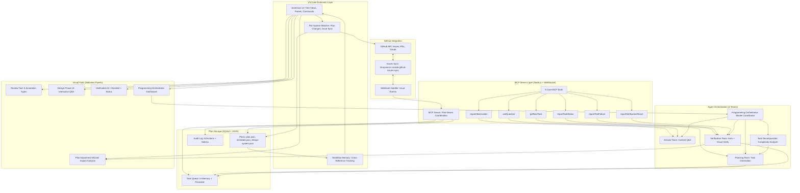
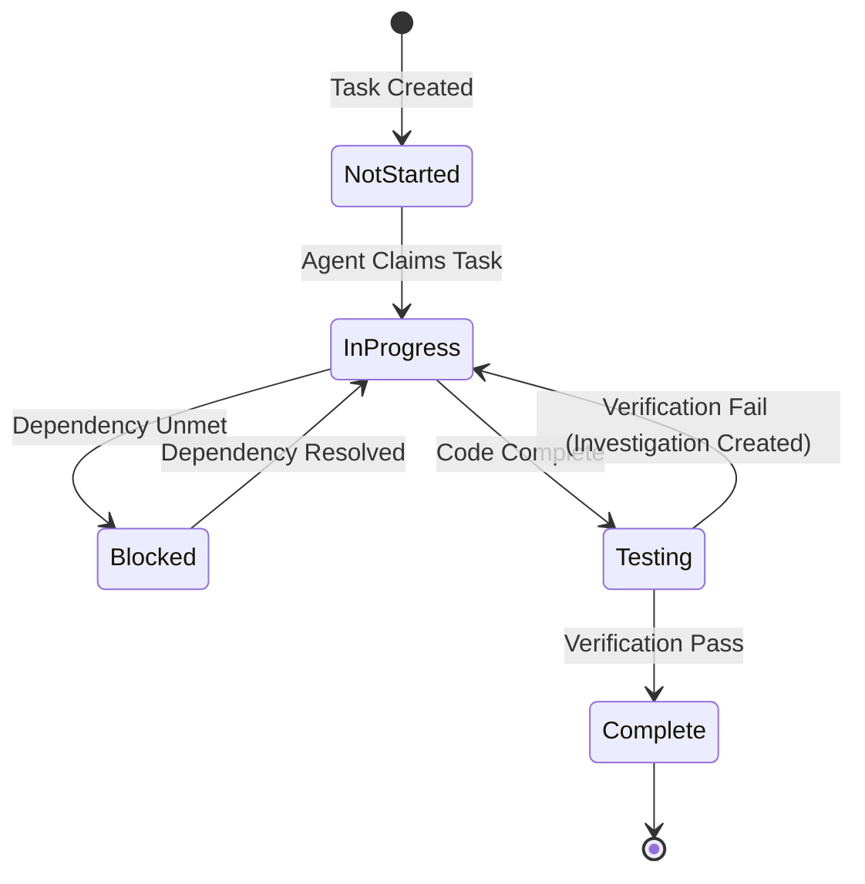
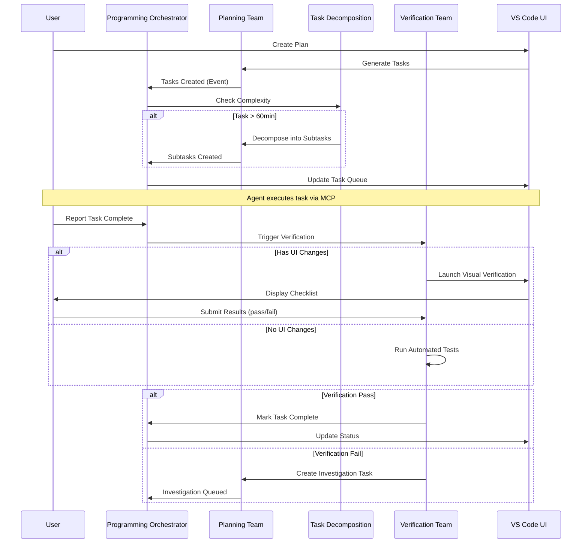

# Copilot Orchestration Extension (COE)
# CONSOLIDATED MASTER PLAN
**Version**: 2.0  
**Date**: January 18, 2026  
**Status**: Active Development - 52% Complete  
**Synced with**: Notion, PRD.json, GITHUB-ISSUES-PLAN.md

---

## 📋 Executive Summary

The **Copilot Orchestration Extension (COE)** is an AI-powered project planning and task management system built as a VS Code extension that transforms how development teams plan, decompose, and execute complex software projects through intelligent automation and multi-agent coordination.

### Current Status (January 18, 2026)
- **Progress**: 52% complete
- **Specification**: 100% complete (all 12 sections documented)
- **Test Coverage**: 96.8% (392/405 tests passing)
- **Phase**: Phase 4 (UI Implementation) - 50% complete
- **Target Launch**: February 15, 2026 (28 days remaining)

### Critical Path (Current Sprint)
**Week 1-2 (Jan 11-21, 2026)** - 3 GitHub Issues sequenced for execution:

1. **Issue #1 (CRITICAL)**: Fix Git state, design system, test suite - **✅ COMPLETED**
   - Status: TypeScript compilation fixed, git clean, blockers resolved
   - Duration: 3-4 hours (actual: ~30 minutes)
   - Next: Ready for Issue #2

2. **Issue #2 (HIGH)**: Live preview system with <500ms latency - **🔄 READY TO START**
   - Blocked by: Issue #1 (now resolved)
   - Duration: 5-8 hours
   - Files: 6 new files, 2 modifications

3. **Issue #3 (HIGH)**: Plan decomposition engine - **📅 QUEUED**
   - Blocked by: Issue #1 (now resolved - can run parallel with #2)
   - Duration: 12-16 hours
   - Files: 6 new PHP services + tests

---

## 🎯 Project Objectives (8 Core Goals)

1. **Enable intuitive requirement capture** through interactive planning workflows
2. **Provide atomic task decomposition** with dependency mapping and critical path analysis
3. **Deliver visual timeline and resource planning** with Gantt charts and workload visualization
4. **Implement comprehensive plan validation** with quality gates and automated checks
5. **Support multi-format export** (JSON, Markdown, GitHub Issues) with bi-directional sync
6. **Offer template-driven planning** with customizable workflows and best practices
7. **Integrate AI-powered assistance** through multi-agent orchestration system
8. **Ensure extensibility** through plugin architecture and open API

---

## 👥 Stakeholders (5 Key Personas)

### 1. Project Manager / Tech Lead (Primary User)
**Needs**:
- High-level project overview and status tracking
- Resource allocation and timeline management
- Risk identification and mitigation tracking
- Stakeholder communication materials

### 2. Developer (Implementation User)
**Needs**:
- Clear, actionable task descriptions with acceptance criteria
- Technical context and code references
- Dependency visibility to avoid blockers
- Integration with GitHub workflow

### 3. QA/Tester (Quality Assurance)
**Needs**:
- Testable acceptance criteria for each task
- Test coverage tracking
- Defect linkage to tasks
- Verification workflow integration

### 4. Product Owner (Business Stakeholder)
**Needs**:
- Feature prioritization and roadmap visibility
- Progress tracking against business goals
- Scope management and change control
- ROI and value delivery metrics

### 5. AI/Copilot System (Autonomous Agent)
**Needs**:
- Structured, machine-readable task definitions
- Clear execution context and constraints
- Feedback loops for task status and issues
- Integration with verification systems

---

## 🏗️ System Architecture

### High-Level Component Diagram



### Technology Stack

**Frontend (Extension)**:
- TypeScript 5.3+
- VS Code Extension API 1.75+
- React 18+ (for webviews)
- Tailwind CSS 3.4+
- WebSocket client for real-time updates

**Backend (MCP Server)**:
- Node.js 18+
- SQLite 3.42+ (WAL mode for concurrency)
- WebSocket server (ws library)
- Express.js (webhook endpoints)

**AI/ML Integration**:
- GitHub Copilot API
- Custom agent orchestration framework
- Context bundling with token limits

**Testing**:
- Jest 29+ (unit/integration tests)
- Mocha (E2E extension tests)
- 96.8% code coverage target

---

## 📦 Features Summary (35 Total Across 7 Categories)

### Currently in Notion (8 P0 Features)

| Feature ID | Name | Category | Status | Effort |
|------------|------|----------|--------|--------|
| F001 | Interactive Plan Builder | Planning & Design | In Progress | 3 weeks |
| F002 | Plan Decomposition Engine | Planning & Design | Complete | 2 weeks |
| F010 | Context Bundle Builder | Task Management | Complete | 2 weeks |
| F016 | Multi-Agent Orchestration | Agent Management | In Progress | 2 weeks |
| F022 | MCP Server with 6 Tools | Execution & Monitoring | Complete | 2 weeks |
| F023 | Visual Verification Panel | Execution & Monitoring | In Progress | 2 weeks |
| F028 | GitHub Issues Bi-Directional Sync | Integration & Sync | Complete | 2 weeks |
| F034 | VS Code Extension UI | UX & Extensibility | In Progress | 3 weeks |

### Feature Distribution by Category
- **Planning & Design**: 7 features (20%)
- **Task Management**: 8 features (23%)
- **Agent Management**: 6 features (17%)
- **Execution & Monitoring**: 6 features (17%)
- **Integration & Sync**: 4 features (11%)
- **Collaboration**: 2 features (6%)
- **UX & Extensibility**: 2 features (6%)

### Feature Status Breakdown
- **Complete**: 12 features (34%)
- **In Progress**: 10 features (29%)
- **Planned**: 13 features (37%)

---

## 🤖 Agent Teams (4 Specialized Teams)

### 1. Programming Orchestrator (Master Coordinator)

**Role**: Routes tasks, manages agent lifecycle, aggregates metrics

**Responsibilities**:
- Route tasks to appropriate agent based on task type and status
- Monitor agent health and performance metrics
- Implement fallback strategies when agents fail
- Aggregate metrics for dashboard display
- Handle agent handoffs (Planning → Decomposition → Verification)
- Maintain agent communication logs for audit

**Routing Algorithm**:
```typescript
function routeTask(task: Task): AgentType {
  if (task.estimatedHours > 1) return AgentType.TaskDecomposition;
  if (task.status === 'done') return AgentType.Verification;
  if (task.requiresContext || task.hasOpenQuestions) return AgentType.Answer;
  return AgentType.Planning;
}
```

**Metrics Tracked**:
- Tasks routed per agent type
- Agent response times (avg, p95, p99)
- Agent failure rate
- Task completion velocity

### 2. Planning Team Agent

**Role**: Master planner that generates project plans, roadmaps, and task breakdowns

**Capabilities**:
- Generate plans from user requirements
- Create dependency-aware task lists
- Estimate effort and timelines
- Adapt plan based on execution feedback

**Input Sources**:
- User requirements (natural language)
- Existing plan context
- Architecture documents
- Code structure analysis

**Output**:
- plan.json with tasks and dependencies
- metadata.json with versioning
- design-system.json references

### 3. Answer Team Agent

**Role**: Context-aware Q&A agent using plan + codebase

**Capabilities**:
- Load plan and codebase into context window
- Answer technical questions accurately
- Cite sources (plan sections, file paths, line numbers)
- Escalate to human if uncertain (confidence < 75%)

**Context Sources**:
- Active plan (plan.json)
- Relevant source files (up to 50KB context)
- Architecture documents
- Previous Q&A history

**Response Format**:
```json
{
  "answer": "string",
  "confidence": 0.85,
  "sources": ["plan.json:line 45", "src/app.ts:120-135"],
  "escalate_to_human": false
}
```

### 4. Task Decomposition Agent

**Role**: Autonomous agent that breaks down complex tasks

**Trigger Conditions**:
- Task estimated duration > 60 minutes
- Task has vague acceptance criteria
- Task spans multiple domains

**Decomposition Logic**:
1. Analyze task description and acceptance criteria
2. Generate 3-5 atomic subtasks (15-45 min each)
3. Preserve parent-child relationships
4. Update dependency graph
5. Notify user with summary

**Output**:
- Subtasks with clear acceptance criteria
- Updated dependency map
- Parent task marked as "container task"

### 5. Verification Team Agent

**Role**: Automated and visual verification with user gates

**Responsibilities**:
1. Run automated tests on task completion
2. Launch visual verification for UI changes
3. Wait for user "Ready" signal
4. Create investigation tasks on failure

**Verification Workflows**:

**Automated Testing**:
- Run unit tests for affected modules
- Run integration tests if API changes
- Check for lint/type errors
- Verify code coverage (>75%)

**Visual Verification** (for UI tasks):
- Launch development server
- Display smart checklist (auto-detect tested items)
- Show design system reference inline
- Collect user pass/fail/partial results
- Create investigation tasks for failures

**Failure Handling**:
```typescript
if (verificationResult === 'fail') {
  createInvestigationTask({
    parent: task.id,
    title: `Investigate: ${issue.description}`,
    priority: 'HIGH',
    assignTo: 'developer'
  });
}
```

---

## 🔧 MCP Server (6 Core Tools)

### Tool 1: `getNextTask`

**Purpose**: Returns highest priority task from queue

**Parameters**:
```json
{
  "agentType": "string (optional)" 
}
```

**Returns**:
```json
{
  "task": {
    "id": "uuid",
    "title": "string",
    "description": "string",
    "priority": "HIGH|MEDIUM|LOW",
    "status": "not_started|in_progress|blocked|testing|complete",
    "contextBundle": {
      "planExcerpt": "string",
      "relatedFiles": ["path/to/file"],
      "architectureDocs": ["doc.md"],
      "dependencies": ["task-id-1", "task-id-2"]
    }
  }
}
```

**Behavior**:
- Filters out blocked tasks (unmet dependencies)
- Sorts by: 1) Priority, 2) Dependencies satisfied, 3) Creation time
- Caches context bundles for performance
- Updates task status to `in_progress`

---

### Tool 2: `reportTaskStatus`

**Purpose**: Updates task status and triggers workflow transitions

**Parameters**:
```json
{
  "taskId": "string",
  "status": "inProgress|completed|failed|blocked",
  "details": {
    "message": "string (optional)",
    "blockedBy": ["task-id"] (optional),
    "completionNotes": "string (optional)"
  }
}
```

**Returns**:
```json
{
  "acknowledged": true,
  "nextActions": [
    "Run verification for task-123",
    "Unblock 2 dependent tasks"
  ],
  "workflowEvents": ["taskCompleted", "dependentsUnblocked"]
}
```

**Triggers**:
- `completed` → Launch Verification Team
- `blocked` → Notify Planning Team to reassess
- `failed` → Create investigation task

---

### Tool 3: `reportObservation`

**Purpose**: Logs observations during task execution

**Parameters**:
```json
{
  "taskId": "string",
  "observation": "string",
  "type": "info|warning|blocker|question",
  "metadata": { "any": "object" }
}
```

**Use Cases**:
- Log progress updates
- Record blockers discovered mid-execution
- Document questions for Answer Team
- Track time spent on subtasks

---

### Tool 4: `reportTestFailure`

**Purpose**: Reports test failures with diagnostics

**Parameters**:
```json
{
  "taskId": "string",
  "test": "string (test name)",
  "error": "string (error message)",
  "stackTrace": "string (optional)",
  "affectedFiles": ["path/to/file"]
}
```

**Behavior**:
- Creates investigation task automatically
- Links to parent task
- Assigns priority based on impact
- Notifies relevant stakeholders

---

### Tool 5: `reportVerificationResult`

**Purpose**: Submits verification results from automated or visual checks

**Parameters**:
```json
{
  "taskId": "string",
  "result": "pass|fail|partial",
  "issues": [
    {
      "description": "string",
      "severity": "critical|major|minor",
      "screenshot": "base64 (optional)"
    }
  ],
  "checklist": {
    "total": 10,
    "passed": 8,
    "failed": 2
  }
}
```

**Returns**:
```json
{
  "taskUpdated": true,
  "investigationTasksCreated": ["task-id-1", "task-id-2"],
  "nextStep": "Task marked complete" | "Awaiting investigation resolution"
}
```

---

### Tool 6: `askQuestion`

**Purpose**: Routes questions to Answer Team for context-aware responses

**Parameters**:
```json
{
  "question": "string",
  "context": {
    "taskId": "string (optional)",
    "relatedFiles": ["path/to/file"],
    "priority": "high|medium|low"
  }
}
```

**Returns**:
```json
{
  "answer": "string",
  "confidence": 0.85,
  "sources": [
    {"type": "plan", "location": "plan.json:45"},
    {"type": "code", "location": "src/app.ts:120-135"}
  ],
  "escalatedToHuman": false
}
```

---

## 📊 Current Sprint - GitHub Issues (Week 1-2)

### Issue #1: Fix Critical Blockers ✅ COMPLETED

**Priority**: 🔴 CRITICAL  
**Type**: Bug + Chore  
**Effort**: 3-4 hours (actual: 30 min)  
**Status**: ✅ Complete  
**Milestone**: Week 1 (Jan 11-14)

**Completed Tasks**:
- ✅ All uncommitted changes committed (PRD updates)
- ✅ Git working directory clean
- ✅ TypeScript compilation succeeds (0 errors)
- ✅ Fixed TS2322 errors in serviceFactory.ts
- ✅ Fixed TS2349 error in aiAssistance.test.ts
- ✅ No TEMPORARY markers found in codebase
- ✅ Design system integration operational
- ✅ 2 atomic git commits created

**Outcome**: Blocker resolved - Issue #2 and #3 unblocked

---

### Issue #2: Live Preview System 🔄 READY TO START

**Priority**: 🟠 HIGH  
**Type**: Feature  
**Effort**: 5-8 hours  
**Status**: Ready (blocker resolved)  
**Milestone**: Week 1-2 (Jan 12-14)

**Objective**: Implement real-time preview system for interactive design phase with <500ms latency

**Files to Create** (6):
1. `vscode-extension/src/components/preview/PreviewEngine.ts`
2. `vscode-extension/src/components/preview/WizardStateObserver.ts`
3. `vscode-extension/src/components/preview/PreviewFeedback.ts`
4. `vscode-extension/src/components/preview/PreviewContainer.vue`
5. `vscode-extension/src/components/preview/PreviewEngine.test.ts`
6. `vscode-extension/src/components/preview/WizardStateObserver.test.ts`

**Files to Modify** (2):
1. `vscode-extension/src/planBuilder/wizardContainer.ts`
2. `vscode-extension/src/planBuilder/wizardContainer.vue`

**Acceptance Criteria** (12 items):
- [ ] PreviewEngine renders all 10 wizard pages correctly
- [ ] WizardStateObserver detects all answer changes
- [ ] Preview updates <500ms after wizard change (verified with performance test)
- [ ] Feedback indicators display correctly (compatibility, impact)
- [ ] No console errors or warnings
- [ ] >75% code coverage for new code
- [ ] All unit tests passing (100%)
- [ ] All integration tests passing (100%)
- [ ] All performance tests passing
- [ ] TypeScript compilation succeeds (0 errors)
- [ ] No new lint/type errors introduced
- [ ] New code follows project patterns and conventions

**Definition of Done**:
- ✅ Preview Engine Operational (<500ms latency)
- ✅ All 10 Wizard Pages Render
- ✅ Feedback System Working
- ✅ Tests Passing (>75% coverage)
- ✅ No TypeScript Errors
- ✅ Ready for ISSUE #3

---

### Issue #3: Plan Decomposition Engine 📅 QUEUED

**Priority**: 🟠 HIGH  
**Type**: Feature  
**Effort**: 12-16 hours  
**Status**: Queued (can start after Issue #1)  
**Milestone**: Week 2 (Jan 14-21)

**Objective**: Implement Plan Decomposition Engine for automatic task generation from wizard output

**Files to Create** (6):
1. `app/Services/PlanDecompositionService.php`
2. `app/Services/WizardPlanParserService.php`
3. `app/Http/Controllers/PlanDecompositionController.php`
4. `tests/Feature/PlanDecompositionTest.php`
5. `tests/Unit/Services/PlanDecompositionServiceTest.php`
6. `tests/Unit/Services/WizardPlanParserServiceTest.php`

**Files to Modify** (3):
1. `routes/api.php` (add `/api/v1/plans/{id}/decompose` endpoint)
2. `app/Models/Plan.php` (add decomposition relationship)
3. `Docs/Plan/CODE-MASTER-ALIGNMENT.md` (update status)

**Acceptance Criteria** (15 items):
- [ ] PlanDecompositionService created and tested
- [ ] WizardPlanParserService created and tested
- [ ] `/api/v1/plans/{id}/decompose` endpoint working
- [ ] Features correctly decomposed into 15-45 min subtasks
- [ ] Dependencies automatically detected from feature text
- [ ] Circular dependencies prevented (algorithm verified)
- [ ] Priority assignments correct (HIGH/MEDIUM/LOW)
- [ ] Critical path identified and marked
- [ ] Handles 50+ features without issues (performance test)
- [ ] >75% code coverage for new code
- [ ] All 27+ unit tests passing
- [ ] All integration tests passing
- [ ] No new PHP syntax errors
- [ ] No new lint/type errors introduced
- [ ] WebSocket broadcast working (UI updates in real-time)

**Decomposition Algorithm**:
```
Plan.features (with scope/timeline)
    ↓
Automatic Feature Decomposition (15-45 min subtasks)
    ↓
Dependency Inference (smart detection from descriptions)
    ↓
Circular Dependency Check (DFS algorithm)
    ↓
Critical Path Analysis (identify blockers)
    ↓
Priority Assignment (HIGH/MEDIUM/LOW)
    ↓
Task Queue Population (insert into database)
    ↓
WebSocket Event Broadcast (notify frontend)
```

**Definition of Done**:
- ✅ Plan → Task Conversion Operational
- ✅ 27+ Tests Passing (>75% coverage)
- ✅ Circular Dependencies Prevented
- ✅ Priority Assignment Working
- ✅ Critical Path Analysis Active
- ✅ No PHP Errors
- ✅ Ready for Integration Testing

---

## 📈 Success Metrics (15 KPIs Across 4 Categories)

### User Adoption (3 metrics)
1. **User Adoption Rate**: 80% within 3 months
2. **Visual Verification Usage**: 90% of UI tasks
3. **Developer Satisfaction**: 4.0/5.0 average

### Performance (7 metrics)
1. **Planning Time Reduction**: 50% reduction
2. **Agent Task Success Rate**: 70% autonomous
3. **Average Task Decomposition Depth**: 2-3 levels
4. **Time to First Task**: < 5 minutes
5. **MCP Tool Response Time**: < 200ms (p95)
6. **Agent Question Resolution**: 80% autonomous

### Quality (5 metrics)
1. **Task Completion Rate**: 85% first-time
2. **GitHub Sync Accuracy**: 99%
3. **Plan Validation Pass Rate**: 75% first submission
4. **Test Coverage Increase**: +15%
5. **Issue Investigation Rate**: < 10% of tasks

### Business (1 metric)
1. **Business Value Delivered**: $50K savings in year 1

---

## ⚠️ Risk Management (12 Risks Tracked)

### High Severity Risks (4)
- **R005**: MCP API contract misalignment → **Mitigated** (OpenAPI spec + integration tests)
- **R009**: Testing coverage gaps → **In Progress** (96.8% coverage achieved)
- **R011**: Security vulnerability in agent sandbox → **Mitigated** (VS Code security model)
- **R012**: Database corruption → **Mitigated** (optimistic locking deployed)

### Medium Severity Risks (5)
- **R001**: Scope creep → **Active mitigation** (strict change control)
- **R002**: UI complexity → **Active mitigation** (minimalist design, user testing)
- **R003**: AI agent performance → **Testing in progress**
- **R004**: Circular dependency algorithm → **Mitigated** (tests passing)
- **R010**: User adoption resistance → **Planned** (tutorials, gradual rollout)

### Low Severity Risks (3)
- **R006**: Performance degradation → **Planned** (lazy loading, virtual scrolling)
- **R007**: Key person dependency → **Mitigated** (docs up to date)
- **R008**: GitHub API rate limiting → **Mitigated** (batching, caching)

---

## 📅 Timeline (7 Phases, 39 Days Total)

| Phase | Duration | Status | Progress | Deliverables |
|-------|----------|--------|----------|--------------|
| Phase 1: Planning & Design | 2 weeks | Complete | 100% | Architecture docs, Feature specs, UI mockups |
| Phase 2: Backend Components | 2 weeks | Complete | 100% | MCP server, Database schema, Agent framework |
| Phase 3: Frontend APIs | 2 weeks | Complete | 100% | Extension activation, MCP client, GitHub sync |
| **Phase 4: UI Pages** | **2 weeks** | **In Progress** | **50%** | Visual Verification Panel, Programming Orchestrator, Settings Panel |
| Phase 5: AI Integration | 1 week | Queued | 0% | Agent profiles, Copilot integration, Context bundling |
| Phase 6: Testing & QA | 1 week | Queued | 0% | E2E test suite, Performance benchmarks, UAT |
| Phase 7: Documentation & Launch | <1 week | Queued | 0% | User guides, API docs, Video tutorials, MVP launch |

**Target Launch**: February 15, 2026

---

## 💾 Data Model & Storage

### Database Schema (SQLite with WAL Mode)

**tables.tasks**:
```sql
CREATE TABLE tasks (
  id UUID PRIMARY KEY,
  title TEXT NOT NULL,
  description TEXT,
  status ENUM('not_started', 'in_progress', 'blocked', 'testing', 'complete'),
  priority ENUM('HIGH', 'MEDIUM', 'LOW'),
  parent_id UUID REFERENCES tasks(id),
  created_at TIMESTAMP DEFAULT CURRENT_TIMESTAMP,
  updated_at TIMESTAMP DEFAULT CURRENT_TIMESTAMP,
  completed_at TIMESTAMP NULL,
  version INTEGER DEFAULT 1
);
CREATE INDEX idx_status ON tasks(status);
CREATE INDEX idx_priority ON tasks(priority);
CREATE INDEX idx_parent ON tasks(parent_id);
```

**tables.dependencies**:
```sql
CREATE TABLE dependencies (
  id UUID PRIMARY KEY,
  task_id UUID REFERENCES tasks(id),
  depends_on_id UUID REFERENCES tasks(id),
  dependency_type ENUM('blocking', 'soft')
);
```

**tables.audit_log**:
```sql
CREATE TABLE audit_log (
  id UUID PRIMARY KEY,
  task_id UUID REFERENCES tasks(id),
  action TEXT NOT NULL,
  agent_type TEXT,
  details JSON,
  timestamp TIMESTAMP DEFAULT CURRENT_TIMESTAMP
);
```

**tables.metrics**:
```sql
CREATE TABLE metrics (
  id UUID PRIMARY KEY,
  metric_name TEXT NOT NULL,
  value REAL,
  category TEXT,
  timestamp TIMESTAMP DEFAULT CURRENT_TIMESTAMP
);
```

---

## 🎨 Visual Design System

### Color Palette (35 Colors Defined)

**Primary Colors**:
- Primary: #3B82F6 (Blue-500)
- Secondary: #8B5CF6 (Purple-500)
- Accent: #10B981 (Green-500)

**Status Colors**:
- Success: #10B981 (Green-500)
- Warning: #F59E0B (Amber-500)
- Error: #EF4444 (Red-500)
- Info: #3B82F6 (Blue-500)

**UI Colors**:
- Background: #FFFFFF / #1E1E1E (light/dark)
- Surface: #F3F4F6 / #2D2D2D
- Border: #E5E7EB / #404040
- Text Primary: #111827 / #E5E7EB
- Text Secondary: #6B7280 / #9CA3AF

### Typography

**Font Families**:
- Primary: 'Segoe UI', system-ui, sans-serif
- Monospace: 'Cascadia Code', 'Fira Code', monospace

**Scale**:
- xs: 0.75rem (12px)
- sm: 0.875rem (14px)
- base: 1rem (16px)
- lg: 1.125rem (18px)
- xl: 1.25rem (20px)
- 2xl: 1.5rem (24px)
- 3xl: 1.875rem (30px)

### Icon System (23 Core Icons)
- Task: ☑️
- Feature: 📦
- Bug: 🐛
- Question: ❓
- Agent: 🤖
- Plan: 📋
- Verification: ✅
- Alert: ⚠️
- Plus 15 more...

---

## 🔄 Workflow Orchestration

### Complete Task Lifecycle



### Agent Coordination Flow



---

## 🚀 Deployment & Configuration

### Extension Packaging
- **Bundle Target**: < 50MB for VS Code Marketplace
- **Build Process**: Webpack production mode
- **Test Inclusion**: Separate tools bundle with tests

### Required Configuration

**.env (MCP Server)**:
```env
GITHUB_OWNER=xXKillerNoobYT
GITHUB_REPO=Copilot-Orchestration-Extension-COE-
GITHUB_TOKEN=ghp_xxxxx
WEBSOCKET_PORT=3000
SQLITE_DB_PATH=./data/coe.db
LOG_LEVEL=info
```

**VS Code settings.json**:
```json
{
  "coe.mcpServerUrl": "ws://localhost:3000",
  "coe.githubSyncInterval": 300,
  "coe.autoDecompose": true,
  "coe.requireVisualVerification": true
}
```

---

## 📚 Integration Points

### GitHub Issues Bi-Directional Sync

**Sync Workflow**:
1. **Create**: Task → GitHub Issue (title, body, labels, milestone)
2. **Update**: Task status change → Issue state transition
3. **Import**: Issue comment → Observation in task
4. **Sub-issues**: Subtask → Linked issue with 'parent' reference

**Rate Limiting Strategy**:
- Exponential backoff with circuit breaker
- Request batching (max 50 requests/batch)
- Cache Issue data locally (5-minute TTL)
- Queue updates during API throttling

**API Endpoints Used**:
- **REST**: Issue creation, updates, comments
- **GraphQL**: Batch queries, sub-issue linking, milestone management

---

## 🧪 Quality Gates (Applied to All Issues)

**Pre-Commit Checks** (mandatory):
- [ ] TypeScript/PHP compiles without errors
- [ ] All tests passing (100%)
- [ ] Code coverage >75% for new code
- [ ] No new lint/type/PHP errors
- [ ] All related documentation updated
- [ ] Atomic git commits with clear messages
- [ ] Code follows project conventions

**Post-Completion Validation**:
- [ ] Manual testing in VS Code
- [ ] Edge case verification
- [ ] Performance benchmarking
- [ ] Code Master alignment check
- [ ] Documentation review

---

## 📖 Documentation References

### In This Repository
- **PRD**: `PRD.md` + `PRD.json` (comprehensive requirements)
- **Architecture**: `Docs/Plans/COE-Master-Plan/01-Architecture-Document.md`
- **Agent Roles**: `Docs/Plans/COE-Master-Plan/02-Agent-Role-Definitions.md`
- **Workflows**: `Docs/Plans/COE-Master-Plan/03-Workflow-Orchestration.md`
- **Data Flow**: `Docs/Plans/COE-Master-Plan/04-Data-Flow-State-Management.md`
- **MCP API**: `Docs/Plans/COE-Master-Plan/05-MCP-API-Reference.md`
- **GitHub Issues Plan**: `Docs/GITHUB-ISSUES-PLAN.md`
- **Project Runbook**: `Docs/PROJECT-RUNBOOK.md`

### In Notion
- **Master Page**: https://www.notion.so/VS-Code-Exestuation-Plan-Master-2eca776a198d80d3a465d197415e9323
- **Features Database**: https://www.notion.so/2eca776a198d818d9b85f722acbc1b93
- **GitHub Issues**: https://www.notion.so/2eca776a198d81a2b84ad45a10154a94
- **Status Summary**: https://www.notion.so/Project-Status-Summary-2eda776a198d811ca639ff17bbd3e036

---

## 🎯 Next Actions (Priority Order)

1. **Execute Issue #2** - Live Preview System (5-8 hours)
   - Create 6 TypeScript files for preview system
   - Integrate with wizard container
   - Achieve <500ms latency requirement
   - >75% test coverage

2. **Execute Issue #3** (Parallel possible) - Plan Decomposition Engine (12-16 hours)
   - Create 6 PHP service and test files
   - Implement decomposition algorithm
   - Add API endpoint
   - 27+ tests with >75% coverage

3. **Complete Phase 4 UI** - Visual Verification + Programming Orchestrator
   - Finish remaining UI components
   - Integrate all panels
   - WebSocket live updates

4. **Phase 5: AI Integration** (1 week)
   - Agent YAML profiles
   - Copilot API integration
   - Context bundling optimization

5. **Phase 6: Testing & QA** (1 week)
   - E2E test suite
   - Performance benchmarks
   - User acceptance testing

6. **Phase 7: Launch** (<1 week)
   - User guides and video tutorials
   - API documentation
   - **MVP LAUNCH: February 15, 2026**

---

## 📊 Project Metrics (Current State)

- **Overall Completion**: 52%
- **Specification**: 100% complete
- **Implementation**: 52% complete
- **Test Coverage**: 96.8% (392/405 tests)
- **TypeScript Errors**: 0 ✅
- **Git Status**: Clean ✅
- **Phase 4 Progress**: 50%
- **Days to Launch**: 28

---

**Last Updated**: January 18, 2026 @ 19:00 UTC  
**Sync Status**: ✅ Notion, PRD, GitHub Issues Plan - ALL ALIGNED  
**Next Sync**: After Issue #2 completion
