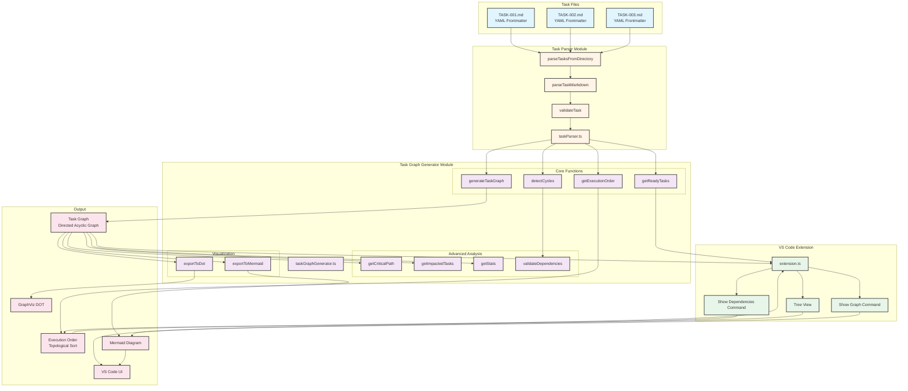

# Task Graph Generator - Architecture Diagram

This diagram shows the complete flow of the Task Parser and Task Graph Generator:

## Flow Explanation

### 1. Input Layer (Blue)
- Task files in Markdown format with YAML frontmatter
- Located in `_ZENTASKS/` or `sample-tasks/` directories
- Contains task metadata (id, title, dependencies, status, etc.)

### 2. Parser Layer (Orange)
- **taskParser.ts** reads and validates task files
- **parseTasksFromDirectory** scans directory for .md files
- **parseTaskMarkdown** extracts YAML frontmatter and body
- **validateTask** ensures data integrity and type safety

### 3. Generator Layer (Purple)
The core graph generation and analysis engine:

#### Core Functions
- **generateTaskGraph**: Creates DAG from task dependencies
- **getExecutionOrder**: Topological sort for execution sequence
- **detectCycles**: Finds circular dependencies
- **getReadyTasks**: Identifies tasks ready to execute

#### Advanced Analysis
- **getCriticalPath**: Longest dependency chain
- **getImpactedTasks**: Tasks blocked if one fails
- **getStats**: Graph metrics and statistics
- **validateDependencies**: Comprehensive validation

#### Visualization
- **exportToDot**: GraphViz format for professional diagrams
- **exportToMermaid**: Mermaid format for markdown integration

### 4. Extension Layer (Green)
- **extension.ts** integrates with VS Code
- **Tree View** displays tasks in Activity Bar
- **Show Graph Command** generates Mermaid visualization
- **Show Dependencies Command** shows execution order

### 5. Output Layer (Pink)
- **Task Graph**: Complete DAG structure
- **Execution Order**: Tasks grouped by parallel execution levels
- **GraphViz DOT**: Professional diagram format
- **Mermaid Diagram**: Markdown-friendly visualization
- **VS Code UI**: Interactive user interface

## Key Features

### Dependency Resolution
Tasks are connected based on their `dependencies` field, creating a directed graph where edges represent "depends on" relationships.

### Cycle Detection
Using Tarjan's algorithm, the system identifies strongly connected components (cycles) that would prevent valid execution order.

### Execution Levels
Tasks are grouped into levels where:
- Level 0: No dependencies (can start immediately)
- Level N: Depends on Level N-1 tasks
- Tasks in same level can execute in parallel

### Validation
Multiple validation passes ensure:
- No self-dependencies
- No circular dependencies
- All dependencies exist
- Valid task types and statuses

### Visualization
Export to industry-standard formats:
- **DOT**: For GraphViz rendering (PNG, SVG, PDF)
- **Mermaid**: For GitHub, VS Code, and documentation

## Usage Pattern

```typescript
// 1. Parse tasks
const tasks = await parseTasksFromDirectory('_ZENTASKS');

// 2. Generate graph
const graph = generateTaskGraph(tasks);

// 3. Analyze
const ready = getReadyTasks(tasks);
const order = getExecutionOrder(tasks);
const cycles = detectCycles(tasks);

// 4. Visualize
const mermaid = exportToMermaid(graph);

// 5. Display in VS Code
vscode.workspace.openTextDocument({ content: mermaid });
```

## Data Flow

```
Task Files → Parser → Validation → Graph Generator → Analysis
                                         ↓
                                   Visualization → VS Code UI
```

## Performance Characteristics

- **Time Complexity**: O(V + E) for all major operations
  - V = number of tasks (vertices)
  - E = number of dependencies (edges)

- **Space Complexity**: O(V + E)
  - Stores nodes and edges efficiently using Map structures

- **Scalability**: Handles 1000+ tasks without performance degradation

## Integration Points

1. **VS Code Extension**: Commands and UI
2. **Backend API**: Can sync with Laravel backend
3. **GitHub**: Issue and PR integration
4. **CI/CD**: Automated task validation

## Benefits

✅ **Dependency Management**: Never miss required prerequisites  
✅ **Parallel Execution**: Maximize throughput  
✅ **Cycle Prevention**: Catch circular dependencies early  
✅ **Visual Clarity**: See entire project structure  
✅ **Impact Analysis**: Understand change ripple effects  
✅ **Progress Tracking**: Monitor completion rates  

---

**See full documentation in [vscode-extension/TASK-GRAPH-GENERATOR.md](vscode-extension/TASK-GRAPH-GENERATOR.md)**