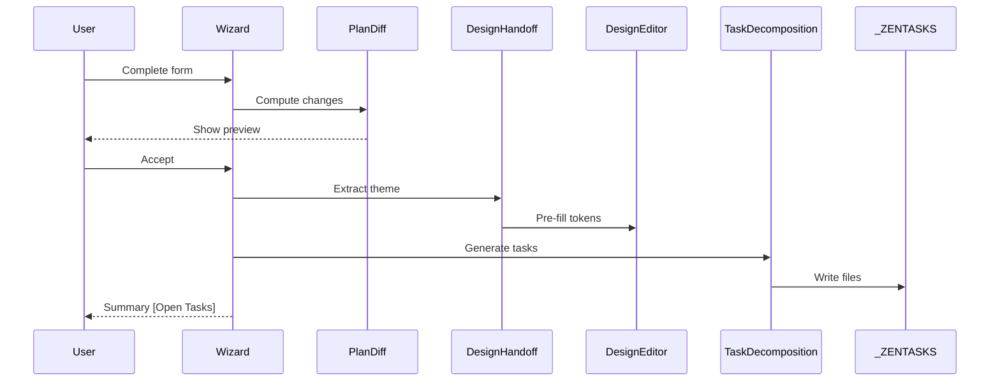
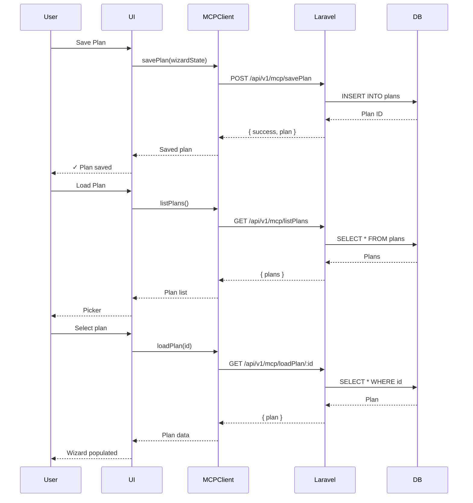

# Plan Builder Integration Guide

## Overview

The Plan Builder now features comprehensive integration with the orchestrator backend, design system, and task management workflows. This guide covers the new capabilities added in Phase 3.

---

## Features

### 1. **Plan Persistence** 🗂️

Save and load wizard states for reuse across sessions.

#### Save a Plan

```typescript
import { savePlan } from './planBuilder/planPersistence';

const wizardState = {
  project_name: 'My Project',
  project_category: 'web_app',
  project_scale: 'medium',
  // ... other fields
};

const saved = await savePlan(wizardState, 'My Project Plan');
```

#### Load a Plan

```typescript
import { loadPlan, selectPlanFromList } from './planBuilder/planPersistence';

// Load by ID
const plan = await loadPlan(42);

// Or show picker
const selected = await selectPlanFromList();
if (selected) {
  // Populate wizard with selected.wizard_state
}
```

#### API Endpoints

- `POST /api/v1/mcp/savePlan` - Save wizard state
- `GET /api/v1/mcp/loadPlan/:id` - Load plan by ID
- `GET /api/v1/mcp/listPlans` - List all saved plans

---

### 2. **Design System Handoff** 🎨

Automatically pass theme/scale data from wizard to Design System Editor.

#### Flow

```
Plan Builder Wizard
  ↓ (extracts theme, colors, typography)
  ↓
Design Handoff Payload
  ↓ (validates & converts)
  ↓
Design Token Structure
  ↓
Design System Editor (pre-filled)
```

#### Usage

```typescript
import { extractDesignDataFromWizard, convertToDesignTokens } from './planBuilder/designHandoff';

const designData = extractDesignDataFromWizard(wizardState);
const tokens = convertToDesignTokens(designData);

// Tokens ready for design editor
```

---

### 3. **Plan Diff Preview** 📊

Compare current plan with wizard-generated changes before applying.

#### Diff UI

Shows:
- ✅ Added tasks
- ❌ Removed tasks
- 📝 Modified tasks
- Impact level (low/medium/high/critical)
- Estimated time change

#### Usage

```typescript
import { computePlanDiff, formatDiffSummary } from './planBuilder/planDiff';

const oldPlan = loadCurrentPlan();
const newPlan = generatePlanFromWizard();

const diff = computePlanDiff(oldPlan, newPlan);
console.log(formatDiffSummary(diff));
```

#### Accept/Reject Options

- **Accept** → Triggers task regeneration
- **Reject** → Cancels wizard without changes
- **Edit** → Returns to wizard for adjustments

---

### 4. **Task Regeneration** 🔄

Wizard completion automatically creates/updates tasks in `_ZENTASKS/`.

#### Flow

```
Wizard Completion
  ↓ (accept diff)
  ↓
Task Decomposition
  ↓
Create Task Files
  ↓
Summary Notification → [Open Tasks] [View Summary]
```

#### Usage

```typescript
import { triggerTaskRegeneration } from './planBuilder/planIntegration';

const result = await triggerTaskRegeneration(wizardState, workspaceRoot);

if (result.success) {
  console.log(`Created ${result.taskCount} tasks`);
}
```

---

### 5. **Quick Task Access** ⚡

One-click button to open the task list.

#### Command

```
copilot-orchestrator.openTaskList
```

#### Keyboard Shortcut

`Ctrl+Shift+T` (default)

#### Behavior

- Opens `_ZENTASKS/tasks.json` if exists
- Falls back to first `.md` task file
- Prompts to create folder if missing

---

### 6. **Design Token Drift Detection** 🔍

Monitors design token files for unintended changes.

#### Monitored Files

- `design-tokens.json`
- `resources/design-tokens/**/*.json`
- `src/styles/tokens.json`

#### Drift Notification

Shows severity (low/medium/high) and change count.

**Actions**:
- View Changes → Opens diff report
- Re-export Tokens → Opens design editor
- Dismiss

#### Usage

```typescript
import { detectDesignTokenDrift } from './drift/designTokenDrift';

const drifts = await detectDesignTokenDrift(workspaceRoot);

drifts.forEach(drift => {
  console.log(`Drift in ${drift.file}: ${drift.changes.length} changes`);
});
```

---

### 7. **Connection Status Badges** 🟢🔴

Real-time indicators for MCP and WebSocket connectivity.

#### Status States

- 🟢 **Connected** - All systems operational
- 🟡 **Degraded** - Connection issues, retrying
- 🔴 **Disconnected** - Service unavailable

#### Status Bar

Displays:
```
✓ MCP | ✓ WS
```

Click for detailed status.

#### Retry Logic

- Auto-retry on failure (max 3 attempts)
- Exponential backoff (1s, 2s, 4s)
- Manual retry via status bar click

---

### 8. **Error Handling & Resilience** 🛡️

Robust error handling with retry logic and circuit breaker pattern.

#### Features

- **Retry with Backoff**: 3 attempts, exponential delay
- **Circuit Breaker**: Opens after 5 consecutive failures
- **Timeout Protection**: 10s default timeout
- **User-Friendly Errors**: No stack traces shown to users

#### Configuration

```typescript
import { retryWithBackoff, withTimeout, CircuitBreaker } from './utils/errorHandler';

const result = await retryWithBackoff(
  () => mcpClient.getNextTask(),
  { maxRetries: 3, initialDelay: 1000 }
);
```

---

## Workflows

### Complete Plan Builder → Task Generation Flow



### Save/Load Plan Flow



---

## Troubleshooting

### MCP Connection Issues

**Symptom**: Status badge shows 🔴 disconnected

**Solutions**:
1. Check Laravel server is running (`php artisan serve`)
2. Verify MCP base URL in settings: `copilot-orchestrator.mcp.baseUrl`
3. Check server logs for errors
4. Click status badge → Retry

### Plan Save Failures

**Symptom**: "Failed to save plan" error

**Solutions**:
1. Ensure database migrations ran (`php artisan migrate`)
2. Check `plans` table exists
3. Verify validation (name required, wizard_state must be object)
4. Check Laravel logs: `storage/logs/laravel.log`

### Task Files Not Created

**Symptom**: Wizard completes but no files in `_ZENTASKS/`

**Solutions**:
1. Check workspace folder is open
2. Verify write permissions on workspace
3. Check extension logs (Output → Copilot Orchestrator)
4. Manually create `_ZENTASKS/` folder

### Design Token Drift Not Detected

**Symptom**: Changes to tokens don't trigger notifications

**Solutions**:
1. Ensure files are tracked in git
2. Check token files are in monitored paths
3. Commit baseline version first
4. Verify drift detector is running (check connection monitor)

---

## Keyboard Shortcuts

| Command | Shortcut | Description |
|---------|----------|-------------|
| Open Task List | `Ctrl+Shift+T` | Opens _ZENTASKS task list |
| Save Plan | — | Via wizard UI |
| Load Plan | — | Via wizard UI |
| Show Connection Details | — | Click status bar badge |

---

## API Reference

### Plan Persistence

```typescript
// Save plan
savePlan(wizardState: Record<string, unknown>, planName?: string): Promise<SavedPlan | null>

// Load plan
loadPlan(planId: number): Promise<SavedPlan | null>

// List plans
listPlans(status?: string): Promise<PlanListItem[]>

// Select from UI
selectPlanFromList(): Promise<SavedPlan | null>
```

### Design Handoff

```typescript
// Extract from wizard
extractDesignDataFromWizard(wizardState: Record<string, unknown>): DesignHandoffPayload

// Validate payload
validateDesignPayload(payload: DesignHandoffPayload): { valid: boolean; errors: string[] }

// Convert to tokens
convertToDesignTokens(payload: DesignHandoffPayload): Record<string, unknown>
```

### Plan Diff

```typescript
// Compute diff
computePlanDiff(oldPlan: Plan, newPlan: Plan): PlanDiffResult

// Format for display
formatDiffSummary(diff: PlanDiffResult): string
```

---

## Configuration

### VS Code Settings

```json
{
  "copilot-orchestrator.mcp.baseUrl": "http://localhost:8000",
  "copilot-orchestrator.mcp.timeout": 10000,
  "copilot-orchestrator.autoOpenTasks": true,
  "copilot-orchestrator.showDiffPreview": true
}
```

### Laravel `.env`

```env
DB_CONNECTION=mysql
DB_DATABASE=copilot_orchestrator
# ... other DB settings
```

---

## Related Documentation

- [PLAN-BUILDER-INDEX.md](../../PLAN-BUILDER-INDEX.md) - Main index
- [task-orchestration-flow.md](../Docs/task-orchestration-flow.md) - Task workflows
- [WEBSOCKET-DOCUMENTATION-INDEX.md](../../WEBSOCKET-DOCUMENTATION-INDEX.md) - WebSocket events
- [Copilot Instructions](./.github/copilot-instructions.md) - Agent workflows

---

**Last Updated**: 2026-01-10  
**Phase**: 3 (Integration Complete)
