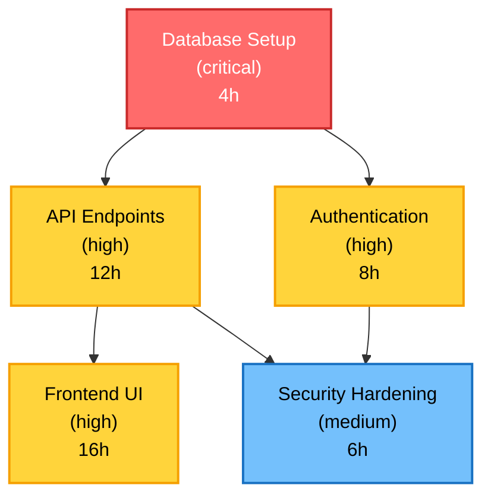

# Sample Markdown Export with Dependency Graph

This is a sample generated Markdown export showing the dependency graph visualization.

## Features

| Feature | Priority | Status | Dependencies | Estimated Effort |
|---------|----------|--------|--------------|------------------|
| Database Setup | critical | pending | None | 4 hours |
| API Endpoints | high | pending | Database Setup | 12 hours |
| Frontend UI | high | pending | API Endpoints | 16 hours |
| Authentication | high | pending | Database Setup | 8 hours |
| Security Hardening | medium | pending | Authentication, API Endpoints | 6 hours |

### Feature Dependency Graph

This shows:
- **Nodes colored by priority**: Red (critical), Yellow (high), Blue (medium), Green (low)
- **Effort in parentheses**: Each node shows estimated hours
- **Dependencies as arrows**: Arrows show which features depend on which
- **Valid Mermaid syntax**: Can be rendered in VS Code Markdown preview or GitHub
