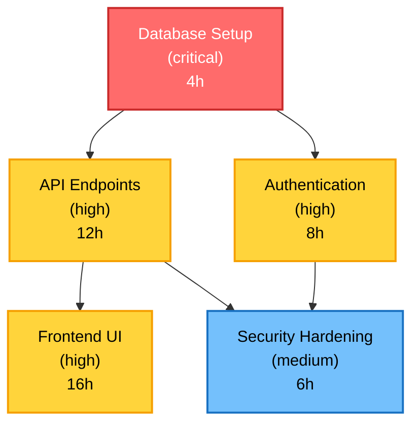
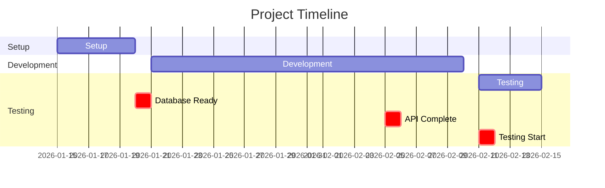

# Sample Markdown Export with Mermaid Visualizations

This document shows samples of the Mermaid dependency graph and Gantt chart visualizations automatically generated by the Markdown exporter.

## Features

| Feature | Priority | Status | Dependencies | Estimated Effort |
|---------|----------|--------|--------------|------------------|
| Database Setup | critical | pending | None | 4 hours |
| API Endpoints | high | pending | Database Setup | 12 hours |
| Frontend UI | high | pending | API Endpoints | 16 hours |
| Authentication | high | pending | Database Setup | 8 hours |
| Security Hardening | medium | pending | Authentication, API Endpoints | 6 hours |

### Feature Dependency Graph

**Key Features:**
- **Nodes colored by priority**: Red (critical), Yellow (high), Blue (medium), Green (low)
- **Effort in parentheses**: Each node shows estimated hours
- **Dependencies as arrows**: Arrows show which features depend on which
- **Valid Mermaid syntax**: Renders correctly in VS Code Markdown preview and GitHub

## Timeline

**Start Date**: 2026-01-15

**End Date**: 2026-02-15

### Phases

| Phase | Start Date | End Date |
|-------|------------|----------|
| Setup | 2026-01-15 | 2026-01-20 |
| Development | 2026-01-21 | 2026-02-10 |
| Testing | 2026-02-11 | 2026-02-15 |

### Timeline Gantt Chart

**Key Features:**
- **Phases as sections**: Each phase appears as a horizontal section
- **Timeline visualization**: Shows project duration and phase structure
- **Milestones marked critical**: Important dates highlighted in red
- **Dependencies supported**: Can show milestone dependencies with arrows
- **Date format**: Uses YYYY-MM-DD format for precise date display

## Implementation Details

### Dependency Graph Algorithm
- Extracts features from plan.json
- Creates Mermaid flowchart nodes with priority-based colors
- Maps feature dependencies to graph arrows
- Applies CSS styling for visual differentiation

### Gantt Chart Algorithm
- Converts phases to Mermaid sections
- Maps milestone dates to Gantt tasks
- Marks all milestones as critical (red highlighting)
- Supports dependency arrows between related tasks

Both visualizations are generated dynamically from plan data and render correctly in:
- ✅ VS Code Markdown preview
- ✅ GitHub Markdown viewer
- ✅ GitLab Markdown renderer
- ✅ Any standard Mermaid-compatible renderer
